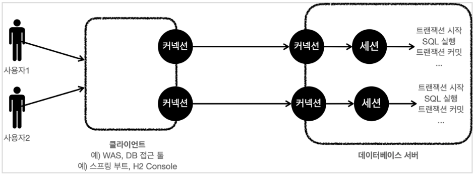

## Transaction

*! DB 시스템에서 수행되는 작업의 단위. 
쿼리가 하나든 여러 개든 모두 Transaction으로 실행된다. 단 건의 쿼리의 경우, 하나의 독립적인 트랜잭션으로 실행된다.*

- 하나의 logical unit을 실행하는 operation의 단위를 transaction이라고 한다.
- transaction은 program execution의 unit이다.
- Begin transaction부터 End transaction 사이의 모든 operation들을 포함한다.
- SQL이나 C++, java와 같은 프로그래밍 언어에 의해 만들어진다.

---

## Transaction의 동작 - DB 세션

> 클라이언트와 DB 사이에 connection 생성 → DB에서 해당 connection과 연결된 세션을 생성 → 해당 connection을 통해 들어오는 모든 요청은 세션을 통해 실행 → 요청이 끝나면 또 다른 요청을 받을 수 있게 세션 유지 → 세션을 끝내기 위해서는 connection을 끊거나 강제 종료
> 

DB 세션: connection에 의해 생성되며, 트랜잭션의 시작과 종료를 담당하는 역할



---

## Transaction의 성질 - ACID

Transaction은 ACID 속성을 준수함으로써 데이터의 일관성과 무결성을 유지할 수 있다.

### 1. Atomicity(원자성)

All or Nothing. 일부만 성공해서는 안되며, 모두 성공하거나 모두 실패하는 성질

### 2. Consistency(일관성)

정의된 DB rules을 지키는 상태를 유지해야 하는 것. constraints, trigger를 통해서 DB에 정의된 rules을 transaction이 위반했다면 rollback 해야 한다.

*! constraints: 데이터가 DB에 들어갈 때 반드시 지켜야 하는 규칙 (ex. NOT NULL, UNIQUE, PRIMARY KEY 등)
! trigger: 특정 이벤트가 발생하면 자동 실행되는 코드*

transaction에 의한 DB rule 위반 여부는 DBMS가 commit 전에 확인하여 에러 메세지를 통해 알려주지만, 이외에 application 관점에서 transaction이 consistent하게 동작하는 지는 개발자가 확인해야 한다.

*! DB는 기본적으로 NOT NULL, UNIQUE, FOREIGN KEY 등만 확인한다. 이외에 잔액은 0보다 많아야한다, 재고가 없으면 주문 불가, 하루 1번 제한 등과 같은 실제 서비스 규칙은 개발자가 확인하여 정의해주어야 한다.*

### 3. Isolation(독립성) ⭐⭐

여러 transaction은 동시에 실행할 수 없으며, 동시에 실행될 때에도 혼자 실행되는 것처럼 동작하게 만든다.

### 4. Durability(지속성) ⭐

commit된 transaction은 DB에 영구적으로 저장된다. DB system에 문제가 생겨도 commit된 transaction은 DB에 남아있으며, 기본적으로 DBMS가 보장해주는 성질이다.

*! DB system 문제: power fail, DB crash 등*

---

## Atomicity을 보장하는 방법

### 1. Commit / Rollback

- **Commit**
transaction의 모든 작업이 성공적으로 완료되고, DB의 상태가 일관성을 유지하는 경우에 사용
transaction을 완료하고 내용을 영구적으로 DB에 저장하려면 commit()을 무조건 수행해야 한다.
- **Rollback**
transaction이 어떠한 이유로 실패하거나 취소해야 할 때 사용하며, 이전 상태로 되돌리는 작업을 의미
transaction에서 진행 중이던 작업을 모두 취소하고 이전 상태로 돌리고 싶으면 rollback을 무조건 수행해야 한다.

commit(), rollback() 실행 시, DB에 영구적으로 저장하거나 이전 상태로 되돌리는 것은 DBMS가 담당하지만, 개발자는 언제 commit()하거나 rollback()할 지 정의하여야 한다.

### 2. AUTOCOMMIT

각각의 SQL문을 자동으로 트랜잭션 처리해주는 개념으로, 모든 단 건의 쿼리마다 자동으로 Commit()이 실행되어 DB에 영구적으로 반영되도록 하는 명령을 말한다.

autocommit = 0(off)으로 설정하면 SQL문이 일시적으로 DB에 저장되고, commit()을 하기 전까지 rollback()으로 이전 상태로 돌아갈 수 있다.

---

## Isolation을 구현하는 방법

DBMS는 여러 종류의 isolation level(격리 수준)을 제공하며, 개발자는 어떤 level로 transaction을 동작 시킬 지 설정할 수 있다. 

### 1. Isolation으로 방지 가능한 문제

- **Dirty Read**
트랜잭션이 Commit되기 전에 수정된 데이터를 다른 트랜잭션이 볼 수 있는 현상
    - Read UnCommited 이하의 격리수준에서 발생
    
    
    
- **Non-repeatable Read**
하나의 트랜잭션에서 두 번의 동일한 조회를 하였을 때, 서로 다른 결과가 조회되는 현상
    - Read Commited 이하의 격리수준에서 발생
    
    
    
- **Phantom Read**
하나의 트랜잭션에서 두 번의 조회를 하였을 때, 다른 트랜잭션의 Insert로 인해 없던 데이터가 조회되는 현상
    - Repeatable Read 이하의 격리수준에서 발생
        
        
        

### 2. Isolation Level(격리수준)

하나의 트랜잭션 내에서 또는 여러 트랜잭션 간의 작업 내용을 어떻게 공유하고 차단할 것인지를 결정하는 레벨

> Read Uncommitted → Read Committed → Repeatable Read → Serializable
> 
1. **Read Uncommitted**
특정 트랜잭션에서 변경된 데이터를 트랜잭션이 commit(), Rollback 여부와 상관없이 다른 트랜잭션에게 보여지는 격리 수준
    - 문제점
    다른 트랜잭션이 commit되기 전의 데이터도 조회가 가능하기 때문에 Dirty Read, Phantom Read, Non-Repeatable Read가 발생한다.
2. **Read Committed**
오직 Commit된 데이터만 읽는 수준의 Isolation
> Commit() 후 수정된 데이터를 조회할 수 있기 때문에 Dirty Read는 발생하지 않는다.
    - 문제점
    만약 A 트랜잭션이 데이터를 수정 중이라면 B는 수정 전 데이터(Undo 영역)를 받기 때문에 A 트랜잭션 commit 후 다시 데이터를 읽게 되면 데이터의 정합성이 깨진다(Non-repeatable Read 발생). 또한 gap-Lock이 아닌 Record-Lock만 걸기 때문에 Phantom Record 현상이 발생한다.
3. **Repeatable Read**
각 트랜잭션에 ID를 부여하여 ID보다 작은 트랜잭션에서만 데이터를 조회한다. 즉, 트랜잭션이 시작되기 전에 커밋된 데이터만 조회한다.
    
    변경된 데이터는 Undo 영역에 트랜잭션 ID와 함께 백업하고 실제 레코드 값을 변경한다. 백업 된 데이터가 불필요하다고 판단하는 시점에 주기적으로 삭제한다.(MVCC)
    
    - 문제점
    Update 부정합, Phantom Read 발생
    - Update 부정합이란?
        
        A 트랜잭션이 수행 중일 때, B 트랜잭션이 수행하여 데이터를 수정했다면 그 이후 A트랜잭션이 수정된 데이터를 수정할 때 수정이 되지 않는 현상
        
    - Read Committed와 Repeatable Read의 차이점
        
        Read Committed : 현 시점 기준
        시점에 따른 최신 데이터를 보여주므로 값 변동이 일어날 수 있다. (Non-repeatable Read)
        
        Repeatable Read : 내가 시작한 시점 기준
        시작 시점의 데이터를 보여주므로 일관된 데이터를 보장하지만, 최신 데이터가 아닐 수도 있다.
        
4. **Serializable**
읽기 작업에서도 공유 잠금을 설정하기 때문에 다른 트랜잭션이 조회 중인 레코드 변경이 불가능하다.
> 대부분의 상황에 대한 방지가 가능하나, 성능이 떨어지고 데드락이 걸릴 확률이 높아진다.
> 일관성이 가장 높고 동시성이 가장 낮은 격리수준

높은 격리 수준을 설정할 경우 더 나은 데이터 일관성을 제공하지만 동시성은 감소한다. 이런 경우 여러 작업을 동시에 처리하지 못하고 하나의 작업이 처리될 때까지 다른 작업들이 대기해야 하기에, Application 성능이 저하된다. 그렇기에 일반적으로는 ‘Read Committed’나 ‘Repeatable Read’를 설정하고, 발생 가능한 동시성 문제를 Lock을 통해 처리한다.

- 실제 현상과 연관 지은 Isolation 4단계
    
    Read Uncommitted(Level=0) : 고립수준이 가장 낮은 명령어로, 자신의 데이터에 아무런 공유락을 걸지 않는다. 또한 다른 트랜잭션에 공유락과 배타락이 걸린 데이터를 대기하지 않고 읽는다. 심지어 다른 트랜잭션이 COMMIT하지 않는 데이터도 읽을 수 있다.
    때문에, Dirty Read가 발생한다.
    
    Read Committed(Level=1) : Dirty Read를 피하기 위해, 자신의 데이터를 읽는 동안 공유락을 걸지만 트랜잭션이 끝나기 전에라도 해지가능하다.
    SQL Server의 기본설정이다.
    Non-Repeatable Read발생 : ex) 트랜잭션 T1은 Book테이블에 저장된 도서 가격의 총액 계산, T1에서 두번 조회한 도서 가격의 총액이 서로 다름 => 이유? 트랜잭션 T2가 중간에 Book테이블의 price를 변경하고 변경된 결과를 T1이 다시 읽었기 때문에 발생
    
    Reapeatable Read(Level=2) : 자신의 데이터에 설정된 공유락과 배타락을 트랜잭션이 종료할 때까지 유지하여 다른 트랜잭션이 자신의 데이터를 갱신(UPDATE)할 수 없도록 한다.
    Phantom Read 발생 : ex) 새로운 데이터가 삽입되어 발생하는 유령데이터 읽기 문제는 해결 할 수 없다. => 이유? 트랜잭션 T1이 Book테이블에 저장된 도서 가격의 총액을 조회하는 과정에서 T2가 중간에 삽입한 데이터 값의 영향을 받기 때문
    
    Serializable(Level=3) : 고립수준이 가장 높은 명령어. 실행 중인 트랜잭션은 다른 트랜잭션으로부터 완벽하게 분리된다. 데이터 집합에 범위를 지어 잠금을 설정할 수 있기 때문에 다른 사용자가 데이터를 변경하려고 할 때 트랜잭션을 완벽하에 분리할 수 있다.
    

### 4. Lock을 사용하는 방식 - DB 충돌 개선

- **Optimistic Lock(낙관적 락)**
    
    transaction의 동시 업데이트가 빈번하지 않을 것이라고 가정하고 버전 관리를 통해 충돌을 감지하는 방식
    실제 DB락을 사용하지 않아 성능상 이점이 있지만, 충돌 시 롤백이 필요하다는 단점이 존재
    일반적으로 나중에 요청된 업데이트를 실패(롤백) 처리
    
    *! 낙관적 락은 DB락이 아니며, 사후에 문제를 감지해서 실패시키는 것이다.
    DB에서 제공해주는 특징을 이용하는 것이 아니라 Application Level에서 잡아주는 Lock이다.*
    
- **Pessimistic Lock(비관적 락)**
    
    동시성 충돌이 빈번할 것으로 예상되는 경우에 사용하며 DB락을 통해 트랜잭션의 충돌을 방지
    DB락은 여러 트랜잭션이 동시에 동일한 데이터를 변경하지 못하도록 막아 데이터의 무결성을 보호하는 시스템이지만 성능 비용을 초래할 수 있다.
    
    - Share Lock(공유 락, 읽기 락, S-Lock)
    - Exclusive Lock(베타 락, 쓰기 락, X-Lock)
- **Distributed Lock(분산 락)**
    
    Redis 같은 공통 저장소를 활용하여 자원의 사용 여부를 체크하는 방식으로 구현
    
    *! Redis는 인메모리 기반의 고성능 키-값 저장소로, 분산락을 구현하는 데 널리 사용되는 솔루션이다.
    Redis에서 락을 획득한다는 의미는 ‘락의 존재여부 확인’과 ‘존재하지 않을 경우 락 획득’이라는 두 가지 행위가 원자적(Atomic)으로 이루어진다는 것을 나타내는데, 락을 획득할 때 사용하는 SETNX(SET if Not eXists) 명령어가 이를 잘 표현한다.*
    
- Lock에 의해 발생하는 교착상태 : Deadlock
    
    Deadlock: 둘 이상의 프로세스가 다른 프로세가 점유하고 있는 자원을 서로 기다릴 때 무한 대기에 빠지는 상태
    
    DB에서 deadlock은 두 개의 transaction이 각각 lock을 정하고 다음 서로의 lock에 접근하여 값을 얻어오려고 할 때, 이미 각각의 트랜잭션에 의해 lock이 설정되어 있기 때문에 양쪽 트랜잭션 모두 영원히 처리가 되지 않게 되는 상태
    

### 3. MySQL에서의 DB Lock

*! Lock은 DBMS마다 구현하는 요소들이 다르다. InnoDB의 경우, 데이터 변경 시에 자동으로 비관적 Lock을 걸기 때문에 아래 내용은 비관적 Lock에 대한 내용이다.*

MySQL에서 Lock과 트랜잭션은 InnoDB에 종속적이다. InnoDB에서 Lock 레벨은 행(row) 단위 Lock을 기본으로 사용하며, 공유 락과 베타 락을 사용한다.

Lock은 데이터 수정(및 읽기)에 대한 권한이다. 데이터 수정을 위해서는 해당 tuple의 lock을 먼저 획득해야 하며, 만약 lock이 없다면 다른 세션에서 획득한 lock을 반납할 때 까지 기다린다. 이때 Lock은 시간 제한이 있으며, 시간이 지나면 락이 자동 반납된다.

> [ 트랜잭션 시작 → 쿼리 실행 → 락 획득 ] → 획득한 락은 트랜잭션 종료(commit/rollback) 시 반납
> 

> 세션 1에서 트랜잭션 시작 → 첫 번째 쿼리와 동시에 lock 획득 → 세션 1이 update문(첫 번째 쿼리) 실행 → 세션 2에서 transaction을 시작하려고 시도 → lock이 없는 경우 대기 → 세션 1에서 commit을 하여 lock을 반납 → 대기 중이던 세션 2가 lock을 획득 → 세션 2가 update문 실행 → 세션 2에서 commit을 하여 lock을 반납
> 

내용이 변경되는 update, delete, insert문이 시작되었을 때 lock을 획득하며, select는 단순 조회이기 때문에 lock을 획득하지 않는다. 하지만 `FOR UPDATE` 구문을 사용하면 select문의 경우에도 락을 획득할 수 있다.

```jsx
// Select문에 Lock 설정하기 -> Transaction 안에 있는 경우에만 해당!
SELECT * FROM users WHERE id = 1 FOR UPDATE; 
```

---

## Durability을 보장하는 방법 - Transaction 회복 기법

### 1. REDO 로그

변경 이력 데이터. 누군가가 무엇을 했다는 정보를 의미한다.

*! transaction에서는 어떤 걸 했는 지 기록하는 로그이며, Commit된 작업을 다시 실행하기 위한 기록이다.*

데이터 변경이 캐시에서 이루어질 때, REDO 로그(변경 이력 데이터)를 생성하고, REDO 로그를 Commit이 발생하기 전에 디스크에 기록하는 방식으로 지속성을 구현하였다.

데이터를 한 번에 기록하는 것으로 I/O의 횟수가 줄어들고, 시퀀셜 액세스를 사용하여 I/O에 소모되는 시간이 줄어든다. 또한 I/O 크기는 커지지만, 입력 위치를 찾는 횟수는 변하지 않으므로 I/O 시간이 지연되지 않는다.

- REDO 로그를 사용하지 않는다면?
    
    지속성을 구현하는 방법을 생각해보면, Commit한 데이터를 즉시 디스크에 기록하면 될 것 같아 보인다. 하지만 여기서 생각해야 하는 부분은 입력 위치를 찾는 시간이 디스크 I/O의 대부분을 차지하고 있다는 디스크의 특성이다. 이 방법으로 대량의 데이터를 변경하면 Commit하는 데 너무 많은 시간이 걸려버린다. 그리고 이때 장애가 발생되어 버리면, 데이터 손실이 일어날 수 있다.
    
- **목적**
    
    Roll-Forward: REDO 로그를 사용하여 과거의 데이터를 최신 데이터 쪽으로 흐르게 하는 것
    
    *! 트랜잭션 후 Commit에 성공했지만, 서버 다운과 같은 장애가 발생하면 데이터 파일 반영이 안 될 수도 있다. 그 때 로그를 사용해서 다시 적용하여 복구하는 개념*
    
- **구조**
    
    > 데이터 변경 시 REDO 로그 생성 → Commit → 서버 프로세스가 LGWR 프로세스에게 REDO 로그를 기록하도록 요청 → LGWR 프로세스가 REDO 로그를 REDO 로그 파일에 기록(flush) → 완료 후 LGWR 프로세스가 서버 프로세스에게 완료 알림 → 서버 프로세스가 Commit이 끝난 것을 클라이언트에게 알림
    > 
    
    서버 프로세스:
    REDO 로그 버퍼에 REDO 로그를 넣는 과정을 수행
    
    REDO 로그 버퍼:
    REDO 로그용 메모리의 역할을 하며 공유 메모리에 존재
    
    LGWR 프로세스:
    서버 프로세스의 요청이나, 자발적인 판단으로 REDO 로그를 디스크에 REDO 로그 파일로 기록하는 과정을 수행
    
    REDO 로그 파일: ⭐
    REDO 로그의 일시적인 보관 창고, 개수가 한정(일반적으로 한 세트에 3개)되어 있으며, 크기도 제한되어 있으므로 REDO 로그를 계속 보관하고 있을 수 없다.
    
    - REDO 로그 파일의 다중화
    ****같은 REDO 로그를 여러 저장소에 동시에 기록하여, 장애 발생 시 로그 손실을 방지하고 복구 가능성을 높이는 개념이다. 이를 통해 REDO 로그 기반의 Durability 보장을 더욱 안정적으로 만든다.
    - Commit 완료 시점은 언제일까?
        
        REDO 로그가 REDO 로그 파일(디스크)에 flush된 순간
        
    
    ARCH 프로세스:
    아카이브 REDO 로그 파일에 옮기는 과정을 수행
    
    아카이브 REDO 로그 파일:
    RODO 로그를 오래 보관해두기 위한 창고
    
    - 프로세스는 어디에 위치할까?
        
        MySQL 서버 내부에서 로그를 처리하는 작업 주체
        
- **장점**
    - **병렬 처리로 인한 높은 처리량**
    기본적으로 여러 서버 프로세스는 데이터를 동시에 변경할 수 있다(단, 같은 데이터는 제외). REDO 로그를 기록할 때에도 LGWR은 여러 서버 프로세스의 REDO 로그를 한 번에 기록하기 때문에 높은 처리량을 구현할 수 있다.
    - **응답 시간 중시**
    commit할 때 블록을 디스크에 기록하지 않고 REDO 로그에 기록하는 것으로 빠른 커밋을 구현할 수 있다.
    - **commit에 대한 데이터 유지**
    장비에 장애가 발생하여 DBWR이 데이터를 기록할 시간이 없었더라고, 그 후에 REDO 로그와 데이터 파일에 남아 있는 이전 데이터를 사용하여 데이터를 복구(roll-forward)할 수 있다.

### 2. UNDO

어떻게 하면 과거의 상태로 돌아갈 수 있는 지에 관한 정보

*! transaction에서 rollback이나 장애를 복구 때, commit 되지 않은 작업을 되돌리기 위한 기록*

- **목적**
    - Rollback:
    에러 발생 시, 기존 작업을 모두 취소하기 위함
    - MVCC(Multi Version Concurrency Control):
    여러 버전의 데이터를 유지해서, 락 없이도 동시에 읽고 쓸 수 있게 하는 방식
        
        트랜잭션이 데이터를 수정할 때 기존 값은 UNDO 영역에 저장되고, 이후 다른 트랜잭션이 데이터를 조회할 때 자신의 시점(Read View)에 맞는 데이터가 필요하면 현재 데이터가 아닌 UNDO에 저장된 이전 버전을 참조한다. 이를 통해 읽기 작업은 락 없이도 수행될 수 있으며, 각 트랜잭션은 자신이 시작된 시점 기준의 일관된 데이터를 조회할 수 있다. 즉, UNDO는 과거 데이터(버전)를 저장하는 역할을 하며, MVCC는 이 UNDO 데이터를 기반으로 각 트랜잭션에 적절한 버전을 제공함으로써 동시성과 일관성을 보장한다.
        
- **구조**
    
    > 데이터 변경 시 UNDO 로그 생성 → UNDO 정보는 UNDO 테이블스페이스 안의 UNDO 세그먼트 안에 저장 → commit 후에도 바로 삭제되지 않고 MVCC를 위해 유지
    > 
    
    UNDO 테이블스페이스:
    UNDO 정보가 보관되는 테이블스페이스이며, 여러 개의 UNDO 세그먼트가 생성된다. 기본적으로 트랜잭션과 UNDO 세그먼트는 1:1로 대응한다.
    
    UNDO 세그먼트:
    Ring Buffer 형식(원형으로 돌면서 재사용되는 저장공간)으로 오래된 UNDO부터 덮어쓰는 버퍼이며, Commit 하지 않은 데이터는 덮어써지지 않는다. 만약, 덮어쓰지 못하고 UNDO 세그먼트가 가득 차면 UNDO 세그먼트가 커진다.
    

undo_retention 파라미터 등으로 UNDO 정보의 유지 시간을 설정할 수 있다. UNDO 정보를 commit한 이후에도 일정 시간 유지하고 싶을 때 유용하다.

---

## Transaction 적용 범위 ⭐

DBMS의 connection과 동일하게 꼭 필요한 최소한의 코드에만 적용하는 것이 좋다.
반드시 Transaction이 필요한 부분만 하나의 transaction으로 묶고, 단순 확인 및 조회와 같이 포함하지 않아도 되는 데이터는 제외하는 것이 좋다.

*! 일반적으로 DB Connection은 개수가 제한적이기 때문에 소유 시간이 길어질 수록 사용 가능한 여유 connection 개수가 줄어들어 대기가 발생할 수 있기 때문에, 최대한 짧게 소유해야 한다.*

특히 네트워크를 통해 원격 서버와 통신하는 작업은 transaction에서 제외해야 한다. 만약 프로그램이 실행되는 동안 메일 서버와 통신할 수 없는 상황이 발생한다면 웹 서버 뿐만 아니라 DBMS 서버까지 위험해지는 상황이 발생하기 때문이다.


- 하나의 connection 안에서 transaction을 짧게 2개로 나누는 것이 길게 1개로 진행하는 것보다 좋은 이유
    - 락(Lock)을 오래 잡고 있어 서비스가 느려지고 대기가 걸린다.
    - Deadlock 위험이 증가한다.
    - 내부적으로 Undo log를 계속 유지하기 때문에 트랜잭션이 길면 Undo / MVCC 부담이 증가한다.
    - 장애 발생 시, 롤백해야 하는 작업이 많아져 복구 시간 및 비용이 증가한다.

---

## MySQL의 데이터베이스 엔진 - InnoDB

데이터베이스 엔진: CRUD 작업의 저장을 도와주는 역할

MySQL의 엔진 설정은 InnoDB가 default 값으로 되어있다. 기존에는 MyISAM 엔진을 사용하다가 transaction의 지원 부재, 더 높은 참조 무결성 제한, 더 높은 동시성 보장을 위해 InnoDB 엔진으로 전환되었다.

- **MyISAM**
예전의 MySQL 기본 엔진
    - transaction 없음
    - 외래키 없음
    - Crash 나면 복구 어려움
    - 테이블 단위 락
- **InnoDB**
5.5ver. 이후의 MySQL 기본 엔진
    - 트랜잭션 지원
    - 외래키 지원
    - Crash 복구 가능
    - 행(row) 단위 락
    - 데이터 무결성 보장
- Crash란?
    
    프로그램이나 서버가 갑자기 강제 종료되어버리는 현상
    

---

## Transaction 명령어 / MySQL

MySQL에서는 default로 autocommit이 enabled 되어있다. (다른 DBMS도 대부분 동일 기능 제공)

MySQL은 Repeatable Read 환경을 기본으로 사용한다.

`START TRANSACTION;` autocommit을 비활성화 하고 트랜잭션을 시작하는 SQL문

`COMMIT;` 지금까지 작업한 내용을 영구적으로 DB에 저장하고 transaction 종료

`ROLLBACK;` 지금까지 작업들을 모두 취소하고 트랜잭션 이전 상태로 되돌리고 transaction 종료

`SET AUTOCOMMIT = 1(활성) or 0(비활성)` autocommit 설정

`SELECT @@ AUTOCOMMIT;` 현재 오토커밋의 활성화 상태 확인