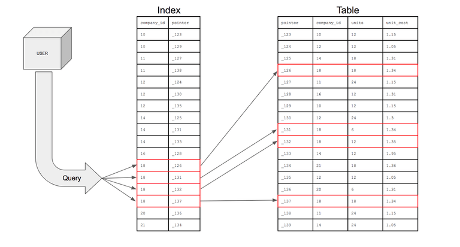

# 3. 데이터 저장 매체와 B-Tree

강의자료: https://code-lab1.tistory.com/217
분야: Database

### 📝 학습 내용 요약

## 디스크 I/O와 인덱스를 통한 DB 성능 최적화

DB가 데이터를 저장할 때 디스크에 저장이 되는데, 이 때 아래 3가지 이유로 디스크 병목이 발생하며, 인덱스, B-Tree, Buffer Pool을 사용하여 효율적으로 만들 수 있다.

- 물리적으로 느린 접근 시간
⇒ 전자식 접근 방식인 SSD를 사용하여 디스크 접근 속도를 개선
- 단 건 조회 시, 랜덤 I/O로 인한 성능 저하
⇒ 인덱스로 데이터 위치 정보를 제공하고, B-Tree 구조를 이용해 탐색 깊이를 줄여 디스크 접근 횟수를 최소화한다.
- I/O 대기 시간
⇒ Buffer Pool을 이용하여 자주 사용하는 데이터를 메모리에 캐싱함으로써 디스크 접근 자체를 줄인다.

### 📄 학습 내용 정리

## 데이터 저장

### 1. 디스크 읽기 방식

*! 디스크의 성능은 디스크 헤더의 위치 이동 없이 얼마나 많은 데이터를 한 번에 기록하느냐(디스크 I/O 시간)에 의해 결정된다.*

**순차 I/O**

연속적인 디스크 위치를 읽는 것

- 전체 조회 시에 발생

**랜덤 I/O**

이미 위치를 알고 있어서 그 위치로 바로 이동하는 것

- 연속적이지 않은 디스크 위치를 읽는 것
- 단 건 조회 시에 발생
- 디스크 구조와 접근 방식(B-Tree 등)으로 자연스럽게 발생하는 현상

### 2. 데이터 저장 매체 - SSD

*! 데이터 저장 매체는 컴퓨터에서 가장 느린 부분이기에 DB의 성능 튜닝은 어떻게 디스크 I/O를 줄이느냐가 관건이다.*

- 컴퓨터에서 CPU나 메모리 같은 주요 장치는 대부분 전자식 장치(반도체 기반)지만, 하드 디스크는 기계식 장치이다.
    - HDD(Hard Disk Drive) : 기계식 하드 디스크 드라이브
    - SSD(Solid State Drive) : 기계식 하드 디스크 드라이브를 대체하기 위한 전자식 저장 매체
- DB 서버는 디스크 접근 속도를 개선하기 위해 랜덤 I/O 속도가 빠른 SSD를 사용한다.
- SSD가 HDD보다 랜덤 I/O가 빠른 이유
    
    HDD는 랜덤 I/O의 경우에도 헤드를 이동하고 디스크를 회전하면서 데이터를 읽으나, SSD는 전기 신호로 바로 접근하는 방식을 사용하기 때문에 빠르다.
    
- 순차 I/O의 속도 차이는?
    
    처음부터 순차적으로 접근하기 때문에 SSD가 조금 빠르거나 거의 비슷하다.
    
- 랜덤 I/O를 조금 느리게 가지고 가고 싼 HDD를 쓰면 안될까?
(DB에서 랜덤 I/O의 속도가 중요한 이유)
    
    DB서버에서는 순차 I/O 작업(전체 조회)보다 랜덤 I/O 작업(단 건 조회 및 수정)이 주를 이루기 때문에 랜덤 I/O 속도가 빠른 SSD를 대부분 사용한다.
    

---

## INDEX

테이블에서 데이터를 빠르게 검색할 수 있도록 도와주는 자료구조

- 특정 칼럼의 값과 그 값의 주소(RowID)를 같이 저장한다.
- DB는 기본적으로 전체 테이블을 순차 I/O 방식으로 탐색하지만, 인덱스를 사용하면 INDEX → ROWID → TABLE 순으로 빠르게 접근하여 랜덤 I/O 방식으로 데이터를 찾는다.
    
    *! ROWID : 하나의 ROW(행)가 물리적으로 저장된 주소 값*
    
- 인덱스는 테이블의 특정 컬럼에 대해 별도의 데이터 구조(B-Tree, Hash 등)를 만들어, 랜덤 I/O를 가능하게 한다.

### 1. Index와 Table



| **구분** | **Table** | **Index** |
| --- | --- | --- |
| **목적** | 데이터를 실제로 저장 | 데이터를 빠르게 찾기 위한 포인터 목록 |
| **저장형태** | 테이블스페이스 내 데이터블록에 row 단위 저장 | 테이블과 별도 공간에 Key + RowID 저장 |
| **구조** | Heap Table, Cluster Table 등 | B-Tree, Bitmap, Hash 등 |
| **읽는 방식** | 전체 스캔 or 인덱스를 통한 접근 | 인덱스 트리 탐색 → RowID로 테이블 접근 |

DBMS에서 인덱스는 조회 성능을 향상시키는 대신, 데이터 변경 시 추가적인 비용을 발생시킬 수 있다.

DBMS의 INDEX는 SortedList 자료구조와 유사하게 저장되는 칼럼의 값을 이용하여 항상 정렬된 상태를 유지한다. SortedList 자료구조는 데이터가 저장될 때 마다 항상 값을 정렬해야 하므로 저장하는 과정이 복잡하고 느리지만, 이미 정렬되어 있어 원하는 값을 빠르게 찾을 수 있다.

DB에서 인덱스와 실제 데이터가 저장된 데이터는 같은 디스크 안에서 서로 다른 구조에 따로 저장된다.

### 2. InnoDB에서 Index - Double Lookup

MyISAM 테이블은 세컨더리 인덱스(PK가 아닌 다른 컬럼을 사용한 인덱스)가 물리적인 주소를 가지나, InnoDB 테이블은 인덱스가 PK를 저장하는 논리적인 주소(클리스터 인덱스)를 가지고, 그 때문에 데이터 조회 시 두 번 탐색(Double Lookup)이 발생한다

- MyISAM 방식
    
    > Secondary index → 데이터
    > 
    - 문제점: 데이터가 수정될 때, 기존 공간이 부족하면 데이터 이동이 발생하고 동시에 주소 변형 발생한다. 따라서 인덱스에 저장된 주소도 함께 갱신해야 하므로 추가적인 비용이 발생한다.
- InnoDB 방식 - Double Lookup
    
    > Secondary index → PK index → 데이터
    > 
    - InnoDB에서는 PK가 RowID의 역할을 동시에 한다.
    - index에 저장되어있는 PK를 이용하여 PK index(B-Tree)를 다시 탐색하고, 해당 리프 페이지에 저장되어있는 레코드를 읽는다.
    - PK가 변경되면?
        
        실무에서는 PK를 절대 바꾸지 않는 값으로 설정한다. (ex. user_id, UUID 등)
        그럼에도 불구하고 PK를 변경한다면, 기존 row 삭제 → 새로운 PK로 insert → 모든 인덱스 수정이 일어나기 때문에 수정 비용이 굉장히 비싸다.
        

### 3. MySQL에서 Index 설정하기

```sql
CREATE INDEX 인덱스명 ON 테이블명(컬럼명); -- 인덱스 생성

DROP INDEX 인덱스명; -- 인덱스 삭제

ALTER INDEX 인덱스명 REBUILD; -- 인덱스 재구성
```

## INDEX의 구조 - B Tree(B-Tree)

- 트리 자료구조의 일종으로 이진트리를 확장해 하나의 노드가 가질 수 있는 자식 노드의 최대 숫자가 2보다 큰 트리 구조
- 일반적으로 B Tree는 B-Tree를 의미하며, B+Tree 또는 B*Tree 형태로 변형하여 사용하기도 한다.

*! B tree를 사용할 때 최대 몇 개의 자식 노드를 가질 것 인지를 결정하는 파라미터가 중요하다.*

### 1. B Tree의 특성


- 노드에는 2개 이상의 key가 들어갈 수 있으며, 항상 정렬된 상태로 저장한다.
- 내부 노드는 ceil(M/2) ~ M 개의 노드를 가질 수 있으며, 최대 M개의 노드를 가질 수 있는 B Tree를 M차 B Tree 라고 한다.
- 특정 노드의 왼쪽 서브 트리는 특정 노드의 Key보다 작은 값들로, 오른쪽 서브 트리는 큰 값들로 구성된다.
- 노드 내 Key는 ceil(M/2)-1개부터 최대 M-1개까지 포함될 수 있다.
- internal 노드의 key 수가 x개라면 자녀 노드의 수는 언제나 x+1개이다.
- 노드가 최소 하나의 key는 가지기 때문에, 몇 차 B tree인지와 상관 없이 internal 노드는 최소 두 개의 자녀를 가진다.
- 모든 리프 노드들이 같은 레벨에 존재한다.

> **B Tree의 파라미터**
> 
> 
> M : 각 노드의 최대 자녀 노드
> M-1 : 각 노드의 최대 Key 수
> ceil(M/2) : 각 노드의 최소 자녀 노드 수(root node, leaf node 제외)
> ceil(M/2)-1 : 각 노드의 최소 key 수(root node 제외)
> 
> *! 트리 구성 시, M만 지정하면 나머지 파라미터는 자동으로 지정됨*
> 

### 2. B Tree의 탐색

- 데이터 탐색은 루트 노드에서 시작하여 하향식으로 진행된다.

> 루트 노드 탐색 → K와 노드의 Key 값을 비교하여 K가 Key값보다 작은 경우에는 좌측으로, 큰 경우에는 우측으로 내려가며 탐색 → K와 동일한 Key값을 찾거나 리프 노드에 도달할 때까지 반복 → 리프 노드에서도 K값을 탐색하지 못한 경우, 값이 존재하지 않는다고 판단
> 

### 3. B Tree의 삽입

- 데이터 삽입은 leaf 노드에서 시작하여 상향식으로 진행된다.
- 노드가 넘치면 가운데 key를 기준으로 좌우 key들은 분할하고 가운데 key는 올라간다.

> 초기 삽입 시, 루트 노드를 할당하고 Key를 삽입 → 초기 삽입이 아닌 경우, 데이터를 넣을 리프 노드를 탐색 → 리프 노드의 데이터 개수 허용 범위 이내라면, Key를 삽입하고 종료 → 리프 노드의 데이터 개수 허용 범위를 벗어나면 Key 분리 진행
> 

### 4. B Tree의 삭제

삭제는 굉장히 복잡한데, 삭제 과정에서 B Tree의 특성에 위반되면 조건에 맞도록 트리를 재구조화 시켜야 한다. 간단하게 설명하자면, 리프 노드에서 공란이 생기면 부모/자식 노드에서 데이터를 계속 가지고와서 균형을 맞춰준다. 문제는 내부 노드일 때 인데, 이 경우에는 삭제할 값을 왼쪽 트리의 가장 큰 값이나 오른쪽 트리의 가장 작은 값과 위치를 변경하고 위 과정을 동일하게 반복하여 균형을 맞춰준다. 글로 보면 꽤 복잡한데 시뮬레이션을 해보면 좀 많이 쉬워진다.

[B-Tree의 탐색/삽입/삭제 시뮬레이션](https://www.cs.usfca.edu/~galles/visualization/BTree.html)

### 5. B Tree 인덱스 Key 값의 크기와 깊이

*! 이해가 어려웠는데, Page = Node라고 이해하면 훨씬 쉬워진다. 그래서 데이터가 삽입되면 페이지(노드)내에 넘치기 전까지 삽입되고 페이지(노드)가 넘치게 되면 페이지(노드)가 트리형태로 구성된다. 그렇기 때문에 B-Tree의 차수는 개발자가 지정하는 것이 아니라, 페이지의 용량에 맞게 들어온 Key값에 따라서 자동으로 정해지는 것이다. Page안에 트리를 그리는 개념이 아니고 Page를 트리형태로 구성하는 것!*

- 일반적으로 DBMS의 B-Tree는 자식 노드의 개수가 가변적인 구조이다. B-Tree 차수는 개발자가 별도 지정하는 것은 아니며, 한 페이지에 넣을 수 있는 Key의 개수(Key의 크기)에 따라 차수가 결정된다.
- 인덱스는 Page단위로 구성되며, 기본값으로 16KB의 용량을 가진다. (MySQL 5.7 이상은 4KB~64KB로 지정할 수 있다)
- 인덱스 깊이의 경우는 개발자가 직접 제어할 방법은 없으며, Key 개수 + Page 크기 + Key 크기에 따라 자동 결정된다. 인덱스의 깊이는 MySQL에서 값을 검색할 때 몇 번이나 랜덤하게 디스크를 읽어야 하는지와 직결되므로 아주 중요하다.
- **Key값 크기 ↑ → Page 내의 Key 개수 ↓ → 인덱스 깊이 ↑ → 디스크 읽기 횟수 ↑**
    
    *! Key값의 크기가 커질수록 하나의 인덱스 페이지가 담을 수 있는 Key값의 개수가 적어지고, 때문에 같은 레코드 건수 이더라고 깊이가 깊어져 디스크 읽기가 더 많이 필요해진다.*
    
- 일반적으로 B-Tree의 깊이는 5단계 이상 깊어지지 않는다.

### 6. B Tree 인덱스의 선택도(기수성)

모든 인덱스 키 값 가운데 유니크한 값의 수

- **인덱스의 선택도 ↑ → 검색 대상 ↓ → 처리속도 ↑**

*! 같은 양의 데이터가 있는 경우, 칼럼의 유니크 값이 적으면(선택도가 작으면) 그에 해당하는 데이터가 많다는 걸 의미하므로 스캔 속도가 오래 걸린다. 반면, 유니크 값이 많으면 해당하는 데이터가 적어짐을 의미하고 불필요한 조회를 줄여 스캔 속도가 줄어든다.*

### 7. B Tree 인덱스를 통한 데이터 읽기

- **Index Range Scan**
    - 검색해야 할 인덱스의 범위가 결정되었을 때 사용하는 방식
    - Index 생성에 사용된 선두 컬럼을 조건절에 사용한 경우에 사용 가능
        
        *! 선두 컬럼 → 다음 컬럼 기준으로 B Tree는 정렬되기 때문에, 선두 컬럼 없이 다음 컬럼만으로는 효율적인 범위 스캔이 어렵다.*
        
- **Index Full Scan**
    - 인덱스 리프 블록 처음부터 끝까지 수평적으로 탐색하는 방식
    - 데이터 검색을 위한 최적의 인덱스가 없을 때 차선으로 선택

### ❓ **질문 & 추가 조사할 내용**

- 
- 

### ✅ **할 일 & 과제**

- 
-