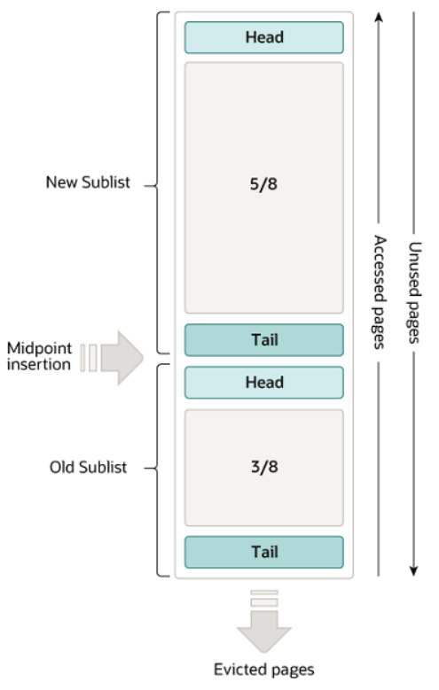

<aside>

Real MySQL 1권 4-2 InnoDB 아키텍처를 읽으며..

내용을 쭉 읽어보니 MyISAM에서 InnoDB로 스토리지 엔진이 변하면서 InnoDB는 어떤 강점을 가지고 있고 어떤 아키텍처로 작동하는 지에 대한 내용 같았다. 그래서 이전에 다른 챕터들을 읽으면서 중복되었던 내용들도 있어서 이번에는 InnoDB의 특징들을 간단히 정리하는 느낌으로 작성해보았다.

버퍼풀 내용은 이전에 얕게 접했던 개념이긴 해서 버퍼풀 내용은 좀 더 집중하여 공부해보았다.

</aside>

## InnoDB 스토리지 엔진의 특징

MyISAM은 구버전, InnoDB는 신버전 스토리지 엔진

MySQL 5.5.5 부터 InnoDB가 기본 스토리지 엔진으로 변경 (2010년 12월)

### 1. PK 클리스터링

InnoDB의 모든 테이블은 기본적으로 PK를 기준으로 클리스터링되어 저장되며, 모든 세컨더리 인덱스는 레코드의 주소 대신 PK값을 논리적인 주소로 사용한다.

MyISAM은 PK 클리스터링 인덱스를 지원하지 않기 때문에, 모든 인덱스는 ROWID를 가진다.

### 2. 외래키 지원

InnoDB에서 외래키는 부모 테이블과 자식 테이블 모두 해당 칼럼에 인덱스 생성이 필요하고, 변경 시에는 반드시 부모 테이블이나 자식 테이블에 데이터가 있는지 체크하는 작업이 필요하므로 잠금이 여러 테이블로 전파되고, 그로 인해 데드락이 발생할 때가 많으므로 개발할 때도 외래 키의 존재에 주의하는 것이 좋다.

### 3. MVCC를 이용한 잠금을 사용하지 않는 일관된 읽기 - Undo log

- **MVCC**(Multi Version Concurrency Control)
트랜잭션마다 서로 다른 데이터 버전을 보게 해서 락을 줄이고 동시에 읽기/쓰기를 가능하게 하는 방식
    
    목적: 잠금을 사용하지 않는 일관된 읽기 제공 (Non-Locking Consistent Read)
    

격리 수준 Read_uncommitted, Read_commited, Repeatable_Read에서 lock 없는 읽기가 가능한 이유가 MVCC 기술을 이용하기 때문이다.

### 4. 자동 데드락 감지

잠금 대기 목록을 그래프(Wait-for-List) 형태로 관리하여 내부적으로 잠금이 교착 상태에 빠지지 않았는지 체크한다.

InnoDB는 데드락 감지 스레드를 가지고 있다.

1. 데드락 감지 스레드가 주기적으로 잠금 대기 그래프를 검사
2. 교착 상태에 빠진 트랜잭션 확인
3. 하나를 강제 종료

#### 종료되는 트랜잭션 판단 기준은?

Undo log 양이 더 적은 트랜잭션

Undo log 레코드가 적다 = 롤백을 해도 언두 처리를 해야할 내용이 적다 ⇒ 트랜잭션 강제 롤백으로 인한 MySQL 서버의 부하를 최소화

#### 동시 처리 스레드 증가로 인한 CPU 과부하 해결 방법

`innodb_deadlock_detect` : Off로 설정 시, 데드락 감지 스레드 작동 멈춤 ⇒ 무한 대기 발생 우려
`innodb_lock_wait_timeout` : 활성화 시, 데드락 상황에서 일정 시간이 지나면 자동으로 요청 실패 후 에러 메세지 반환 (기본값:50s)

`innodb_deadlock_detect` 비활성으로 설정할 경우, `innodb_lock_wait_timeout` 을 기본값보다 훨씬 낮은 시간으로 변경해서 사용할 것을 권장

### 5. 자동화된 장애 복구 - Redo log

WAL(Write Ahead Logging) : 로그 먼저 기록하고 디스크에 반영하기

`innodb_force_recovery` : InnoDB 복구 모드 설정 (1~6)

### 6. 버퍼 풀

Innodb엔진에서 테이블이나 인덱스 데이터를 캐시하는 메모리 영역. I/O를 통해 디스크로부터 페이지 단위 데이터를 조회하면, Buffer Pool에 페이지 단위로 저장.

- **페이지** : DB에서 데이터를 저장하는 단위 (기본값: 16KB)

#### Buffer Pool의 크기

운영체제의 전체 메모리 공간이 8GB 미만인 경우, 50% 정도 비율로 버퍼 풀 설정
8GB 이상인 경우, 50%로 시작하여 조금씩 올려가면서 최적점을 확보
50GB 이상인 경우, 15~30GB를 제외한 모든 공간을 버퍼풀로 할당

`innodb_buffer_pool_size` : InnoDB 버퍼풀 설정 (128MB 단위로 처리)
`innodb_buffer_pool_instances` : 버퍼 풀을 분리해서 관리 (기본값: 8개)

#### Free 리스트

비어있는 페이지들의 목록. 사용자의 쿼리가 디스크의 데이터 페이지를 읽어와야 하는 경우에 사용

#### LRU 리스트

MySQL은 New Sublist(MRU, 5/8) + Old Sublist(LRU, 3/8)로 구성된 변형된 LRU 알고리즘을 사용한다.

- **LRU**(Least Recently Used Alogorithm) : 가장 최근에 사용되지 않은 페이지를 교체하는 알고리즘. 가장 오래된 캐시를 제거
- **MRU**(Most Recently Used) : 가장 최근에 사용된 페이지를 교체하는 알고리즘. 가장 최근에 사용된 캐시를 제거

> 
> 
> 1. 필요한 레코드가 저장된 데이터 페이지가 버퍼 풀에 있는지 검사
> [InnoDB 어댑티브 해시 인덱스 > 테이블 인덱스] 를 통해 페이지를 검색 
> 2. 버퍼 풀에 데이터 페이지가 있다면 MRU 영역 방향으로 승급
> 3. 버퍼 풀에 데이터가 없다면 디스크로부터 필요한 데이터 페이지를 버퍼 풀에 적재와 동시에 LRU 영역 Head 부분에 추가
> 4. LRU 영역에 추가한 데이터 페이지가 조회되면 MRU 영역 방향으로 승급하고, 버퍼풀에 없다면 LRU Head 부분에 추가하는 과정을 반복
> 5. **승급하는 데이터 페이지가 LRU 영역의 Head에 위치했을 경우, 바로 위인 MRU 영역의 Tail이 아닌 MRU 영역의 Head로 이동**
> 6. 1,2,3,4,5 과정이 반복되면서 자주 사용되지 않는 데이터 페이지들은 자연스럽게 LRU 영역의 Tail 쪽으로 밀려나며, 공간을 오버하게 될 경우 페이지는 버퍼 풀에서 제거
> 7. 자주 사용되는 데이터 페이지의 경우 성능 향상을 위해 페이지의 인덱스 키를 어댑티브 해시 인덱스에 추가

변형 LRU 알고리즘 사용 목적: 단순 LRU 구조의 경우, Select등 일회성의 데이터를 가져올 경우 자주 사용되던 페이지가 삭제될 수 있다. 그렇기 때문에 페이지가 다시 참조될 때 New의 Head로 이동시키는 방법을 사용하여 자주 액세스하는 페이지가 캐시의 New에 장기간 남아있을 수 있게 하여 엔진의 성능을 유지시킨다.

#### Flush 리스트

디스크로 동기화되지 않은 데이터를 가진 페이지(= 더티 페이지)들의 목록. 데이터가 변경되면 해당 페이지는 Flush 리스트에서 관리됨과 동시에 변경 내용을 리두 로그에 기록하고, 버퍼 풀에도 변경 내용을 반영한다. 그 후 특정 시점에 리두 로그가 디스크로 기록된다.

#### Buffer Pool과 Redo Log

버퍼 풀의 크기 조정으로는 데이터 캐시 기능만 향상시킬 수 있기에, 쓰기 버퍼링으로 인한 성능 향상을 위해서는 버퍼 풀과 리두 로그 사이의 관계를 알아야 한다.

> 
> 
> 
> UPDATE → Redo Log 기록 → Dirty Page 생성 → Flush → Checkpoint 이동 → Redo 공간 재사용 가능
> 

버퍼 풀은 클린 페이지와 더티 페이지로 구성되어 있으며, 더티 페이지는 디스크와 다른 상태이기 때문에 차후 디스크에 무조건 기록되어야 한다. ⇒ Redo Log 공간이 부족해지면, InnoDB는 dirty page를 디스크에 flush해서 체크포인트를 기록한다

- 클린 페이지 : 디스크에서 읽은 상태로 전혀 변경되지 않은 것
- 더티 페이지 : INSERT, UPDATE, DELETE 명령으로 변경된 데이터를 가진 것

InnoDB 스토리지 엔진은 전체 Redo Log 파일에서 재사용 가능한 공간과 당장 재사용 불가능한 공간을 구분해서 관리하는데, 재사용 불가능한 공간을 활성 리두 로그라고 한다.

Redo Log는 기록될 때마다 로그 포지션 값인 LSN(Log Sequence Number)와 함께 기록한다.

InnoDB 스토리지 엔진은 주기적으로 체크포인트 이벤트(Flush)를 발생시켜 리두 로그와 버퍼 풀의 더티 페이지를 디스크로 동기화 하는데, 이렇게 발생한 체크포인트 중 가장 최근 지점의 LSN이 활성 리두 로그 공간의 시작점이 된다.

- Checkpoint Age : 활성 리두 로그 공간의 크기

#### Buffer Pool Flush

MySQl 5.7 버전 이후부터는 2개의 플러시 기능을 백그라운드로 실행하여 디스크 쓰기 폭증 현상을 방지한다.

- **플러시 리스트 플러시**
    
    리두 로그 공간을 재활용을 위해서는 오래된 리두 로그 공간을 비워야 하는데, 그 이전에 버퍼 풀의 더티 페이지가 먼저 디스크로 동기화되어야 한다.
    
    `innodb_page_cleaners` : 더티 페이지를 디스크로 동기화 하는 클리너 스레드 개수 조정 가능
    `innodb_max_diry_pages_pct` : 버퍼 풀의 더티 페이지 비율 조정 가능(높을 수록 디스크 쓰기 작업 버퍼링 효과가 커짐)
    `innodb_max_dirty_pages_pct_lwm` : 특정 개수 이상의 더티 페이지가 존재하면 디스크로 기록하도록 조정 가능
    `innodb_io_capcity` / `innodb_io_capcity_max` : 각 데이터베이스 서버에서 어느 정도 디스크 읽고 쓰기가 가능한지 설정 가능(더티 페이지 쓰기)
    `innodb_flush_neighbors` : 더티 페이지가 서로 인접해 있는 경우 함께 묶어서 디스크로 기록하는 기능의 활성화 여부 설정 가능
    `innodb_adaptive_flushing` / `innodb_adaptive_flushing_lwm` : InnoDB 스토리지 엔진이 설정값에 의존하지 않고, 리두 로그 증가 속도 분석을 통해 적절한 더티 페이지가 버퍼 풀에 유지될 수 있도록 디스크 쓰기를 실행(어댑티브 플러시 알고리즘)
    
- **LRU 리스트 플러시**
    
    사용 빈도가 낮은 데이터 페이지들을 제거해서 새로운 페이지가 들어올 공간을 만드는데 사용된다. LRU 리스트를 `innodb_lru_scan_depth` 크기 만큼 스캔하면서, 더티 페이지는 디스크에 동기화 시키고 클린 페이지는 즉시 프리 리스트로 옮긴다.
    

### ❓ **질문 & 추가 조사할 내용**

- 
- 

### ✅ **할 일 & 과제**

- 
-
