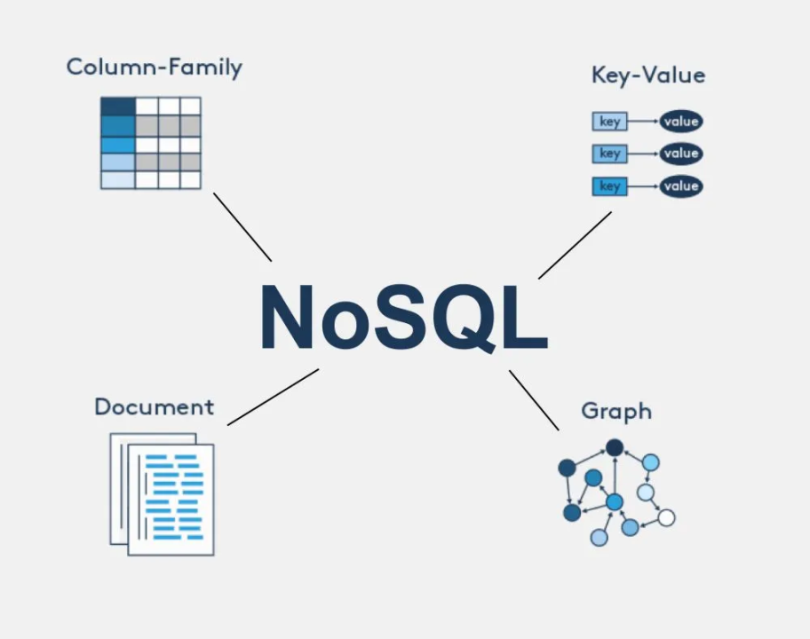
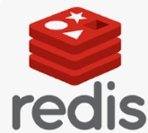

# [2주차] MySQL 스타트

## DB 의 종류 :

### 1. RDB vs NoSQL

- **RDB (Relational Database)**: 정형 데이터 + 스키마 기반 + 관계 중심 (SQL)
- **NoSQL**: 비정형/반정형 데이터 + 스키마 유연 + 확장성 중심

<aside>
💡

`NoSQL : Not Only SQL` → SQL 을 아예 안쓰는게 아니라, SQL만 사용하지 않는 DB

`스키마` → 약간 데이터의 정해진 형태? 라고 보면 됨

</aside>

#### RDB

- **ACID 보장**
    - **원자성(Atomicity)**: 트랜잭션은 모두 실행되거나 전혀 실행되지 않아야 합니다. 중간에 실패하면 모든 변경사항이 취소됩니다.
    - **일관성(Consistency)**: 트랜잭션이 완료된 후에도 데이터베이스는 **일관된 상태를 유지**해야 합니다. 모든 **제약조건과 규칙**이 지켜져야 합니다.
    - **격리성(Isolation)**: 여러 트랜잭션이 동시에 실행될 때도 각 트랜잭션은 다른 트랜잭션의 영향을 받지 않고 **독립적으로 실행**되어야 합니다.
    - **지속성(Durability)**: 트랜잭션이 성공적으로 완료되면 그 결과는 시스템 장애가 발생하더라도 **영구적으로 보존**되어야 합니다.
- 데이터 정확성이 중요한 업무 시스템 → 은행, 대기업, 등등 …
- ex) RDB 삼대장 : MySQL | PostgreSQL | ORACLE

#### NoSQL

- **ACID 보장 안함**
- 그 대신 최종 일관성 (Eventual Consistency) 을 보장
: 꼭 최신은 아닐 수 있지만 업데이트가 되기 전까지는 가지고 있는 최신의 데이터를 반환
- 단순 조회 매우 빠름 → 실시간성이 강한 시스템

→ 이거 말고도 더 많은 종류가 있지만 대표적인 것 들만 알아보자… 

### 2. **Key-Value Database**

<aside>
💡

가장 단순한 형태의 NoSQL 데이터베이스로 각 데이터는 고유한 **키와 그에 대응하는 값**으로 저장된다. 

</aside>

| key | value |
| --- | --- |
| 이름 | 홍길동 |
| 나이 | 30 |
| 자격증 | [1종보통, sqld] |
- **주요 특징:**
    - 스키마가 없어 자유로운 데이터 저장이 가능하다.
    - 단순한 구조로 인해 매우 **빠른 읽기/쓰기** 성능을 제공한다.
- **사용 사례:**
    - 세션 관리, 장바구니, 사용자 프로필 캐싱 등에 사용된다.
    - 실시간 분석, IoT 데이터 처리에 효과적이다.

- 디스크에 데이터를 저장하지 않고 RAM에 1차로 저장하는 방식인 **인메모리 방식**으로 고성능을 제공한다.

### 3. **Document Database**

<aside>
💡

폴더 `collection` 안 파일 `document` 에 JSON같은 형식의 문서로 데이터를 저장한다.

</aside>

- **주요 특징:**
    - 스키마가 유연하여 다양한 구조의 데이터를 저장할 수 있다.
    - 한 폴더 안에 document의 json구조가 달라도 상관없다.
    - 문서 내부 구조를 이해하고 쿼리할 수 있다.
    - 각 문서가 독립적이어서 분산 처리에 적합하다.
    - 수평적 확장이 용이하다.
    - 분산된 데이터베이스 사용 시 데이터 동기화 문제 발생 가능
- **사용 사례:**
    - 콘텐츠 관리 시스템, 블로그 플랫폼 등에 사용된다.
    - 이벤트 로깅, 실시간 분석에 효과적이다.

- MongoDB: 가장 인기 있는 문서 데이터베이스로 JSON을 2진 형태로 인코딩 된 BSON 형식을 사용한다.

## 왜 MySQL 인가?

DBMS 선택 기준

- 안정성
- 성능과 기능
- 커뮤니티나 인지도 : [https://db-engines.com/en/ranking](https://db-engines.com/en/ranking)
    - 웹 사이트 언급 횟수, 검색 빈도, 전문가 인맥 등등 …

→ 오라클과 비교할 때 성능이 크게 딸리지 않음 

→ 오픈소스라 접근이 쉬움 

| 기준 | MySQL | PostgreSQL |
| --- | --- | --- |
| 철학 | 단순성 | 확장성/정확성 |
| 난이도 | 낮음 | 높음 |
| 옵티마이저 | 단순 | 강력 |
| 운영 | 쉬움 | 어려움 |
| 튜닝 | 제한적 | 매우 강력 |
| 실수 리스크 | 낮음 | 높음 |
| 용도 | 웹 서비스 | 데이터 플랫폼 |

## 왜 DB 가 중요한가? (나의 경험)

](image.png)

제 깃허브 소개글 입니다…  [https://github.com/eunseongman](https://github.com/eunseongman)

### PostgreSQL 은 JSON 저장을 제공한다 (MySQL 에도 있긴 함)

[https://www.postgresql.org/docs/current/index.html](https://www.postgresql.org/docs/current/index.html)

### PostgreSQL 에는 JSON을 두 가지 방식으로  저장한다.

| 항목 | JSON | JSONB |
| --- | --- | --- |
| 저장 방식 | 텍스트 그대로 저장 | Binary 형태로 파싱 후 저장 |
| 입력 속도 | 빠름 (그대로 저장) | 느림 (파싱 필요) |
| 조회 속도 | 느림 | 빠름 |
| 키 순서 | 유지됨 | 정렬됨 (순서 보장 X) |
| 공백/포맷 | 유지됨 | 제거됨 |
| 인덱스 지원 | 없음 | 지원 (GIN, GiST 등) |
| 연산자 지원 | 제한적 | 다양 (`@>`, `?`, `->`, `->>` 등) |
| 부분 검색 | 비효율적 | 효율적 |
| 업데이트 | 전체 재작성 | 일부 수정 가능 |
| 저장 공간 | 더 큼 | 더 작음 (압축됨) |

| 항목 | Seq Scan | Bitmap Heap Scan |
| --- | --- | --- |
| 기본 개념 | 테이블 전체를 순차적으로 읽음 | 인덱스로 후보 row 위치를 모은 뒤 해당 블록만 읽음 |
| 동작 방식 | 처음부터 끝까지 한 줄씩 검사 | Bitmap Index Scan → Bitmap Heap Scan |
| 인덱스 사용 | ❌ 사용 안 함 | ✅ 사용 (주로 GIN, B-Tree 등) |
| 성능 특성 | 데이터 많으면 느림 | 조건 선택도 높으면 매우 빠름 |
- Seq Scan → **“다 읽고 거른다”**
- Bitmap Heap Scan → **“필요한 것만 골라서 읽는다”**

| 항목 | LIMIT 상수 (`LIMIT 10`) | LIMIT 파라미터 (`LIMIT $1`) |
| --- | --- | --- |
| 값 인지 여부 | ✅ planner가 정확히 앎 | ❌ generic plan에서는 모름 |
| 플랜 유형 | 항상 custom plan | custom 또는 generic |
| 최적화 수준 | 높음 (값 기반 최적화) | generic이면 낮음 |
| Top-N Sort | ✅ 가능 (잘 나옴) | ❌ 제한적 / 못 나올 수 있음 |
| 정렬 전략 | **필요한 만큼만 정렬** | **전체 정렬 가능성 증가** |
| 인덱스 활용 | 공격적으로 활용 | 보수적으로 선택 |
| 실행 계획 안정성 | 쿼리마다 최적 | 여러 값에 공통 적용 |
| 실행 성능 | **빠름 (특히 작은 LIMIT)** | **느려질 수 있음** |
| 대표 실행계획 | `Limit → Index Scan` 또는 `Top-N heapsort` | `Limit → Sort` 또는 덜 최적화된 계획 |
| 사용 환경 | 일반 SQL | Prepared Statement / ORM |

### 1. 문제는 “파라미터”가 아니라 “Generic Plan”

- 파라미터라도 custom plan이면 문제 없음
- generic plan일 때 문제 발생

---

### 2. 언제 generic plan이 되냐

- Prepared Statement 반복 실행 시
- ORM (JPA, MyBatis 등)
- PostgreSQL이 “재사용이 더 낫다”고 판단할 때
