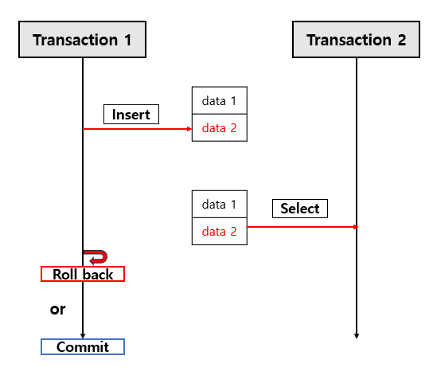

# [3주차] 05. 트랜잭션과 잠금

# Lock과 MVCC

## Lock이란

Lock은 말 그대로 **다른 트랜잭션의 접근을 막는 방식**이다.

- MySQL 에서 사용되는 잠금은 크게 스토리지 엔진 레벨과 MySQL 엔진 레벨로 나눌 수 있다.
- MySQL 엔진의 잠금은 모든 스토리지 엔진에 영향을 미친다.

### MySQL 엔진 잠금

- 글로벌 락
    
    `FLUSH TABLES WITH READ LOCK` 
    
    - MySQL 서버에 존재하는 모든 테이블을 닫고 잠금을 건다
- 테이블 락
    - 개별 테이블 단위로 설정되는 잠금
    - 명시적으로는 `LOCK TABLES table_name [READ | WRITE]` 로 획득 → `UNLOCK TABLES` 로 해제
    - 묵시적으로는 쿼리가 실행되는동안 자동 획득 및 해제
- 네임드 락
    - `GET_LOCK()` 함수를 이용해 임의의 문자열에 대해 잠금
    - 배치 프로그램처럼 한꺼번에 많은 레코드를 변경하는 쿼리에 유용
- 메타데이터 락
    - 데이터베이스 객체의 이름이나 구조를 변경하는 경우에 획득하는 잠금

### InnoDB 스토리지 엔진 잠금

- 레코드 락
    - 레코드 자체만을 잠금, InnoDB는 레코드 자체가 아니라 인덱스의 레코드를 잠금
    - InnoDB는 UPDATE 시 인덱스를 잠구기 때문에, 인덱스가 없다면 테이블을 풀 스캔하면서 UPDATE를 잠구게 되는데, 이 때 모든 레코드를 잠구게 된다. → 인덱스의 중요성
- 갭 락
    - 다른 레코드와 인접한 사이의 간격만을 잠그는 락, 레코드 사이의 INSERT 를 제어
- 넥스트 키 락
    - 레코드 락 + 갭 락, `REPEATABLE READ` 격리 수준을 사용해야 함
- 자동 증가 락
    - `AUTO_INCREMENT` 의 중복을 막기 위해 사용하는 락, INSERT나 REPLACE 문장에서 AUTO_INCREMENT를 가져오는 순간만 락이 걸렸다가 즉시 해제

## MVCC란

MVCC는 Multi-Version Concurrency Control의 약자다.

- 데이터를 덮어쓰지 않고, 여러 버전을 유지해서 읽기와 쓰기가 서로 덜 방해하게 만든다.
- PostgreSQL와 MySQL 의 동작 방식이 조금 다른데,

PostgreSQL 

- 읽는 쪽은 굳이 락을 기다리지 않고 **자신에게 보이는 버전**을 읽는다.
- 즉, row 자체에 버전 계속 쌓이는 구조 (tuple chain)

MySQL

- 반면, MySQL은 현재 row 1개 + 과거는 undo log에 저장

# 격리 수준(Isolation Level)

격리성은 중요하지만, 무조건 가장 강하게 걸면 성능이 떨어진다.

그래서 DB는 **격리 수준**을 제공한다.

---

### 격리 수준에서 막고 싶은 문제들

### Dirty Read

다른 트랜잭션이 아직 commit하지 않은 데이터를 읽는 것

### Non-repeatable Read

같은 트랜잭션 안에서 같은 쿼리를 두 번 실행했는데 값이 달라지는 것

### Phantom Read

같은 조건으로 두 번 조회했는데, 없던 행이 생기거나 있던 행이 사라지는 것

| 구분 | Non-repeatable Read | Phantom Read |
| --- | --- | --- |
| 대상 | 같은 row | row 집합 |
| 변화 | 값 변경 | 개수 / 존재 변경 |
| 원인 | UPDATE, DELETE | INSERT, DELETE, UPDATE |

**Non-repeatable Read** 

같은 row를 다시 읽었는데 값이 바뀜 → 이미 존재하던 row의 값이 변함

**Phantom Read**

같은 조건으로 조회했는데 결과 집합 자체가 바뀜 → row 개수 / 존재 여부 변화

### 격리 수준 표

| 격리 수준 | Dirty Read | Non-repeatable Read | Phantom Read |
| --- | --- | --- | --- |
| Read Uncommitted | 발생 가능 | 발생 가능 | 발생 가능 |
| Read Committed (Oracle, Postgre Default) | 방지 | 발생 가능 | 발생 가능 |
| Repeatable Read (InnoDB Default) | 방지 | 방지 | 일부 DB에서 발생 가능 (주류 DB 대부분 방지됨) |
| Serializable | 방지 | 방지 | 방지 |