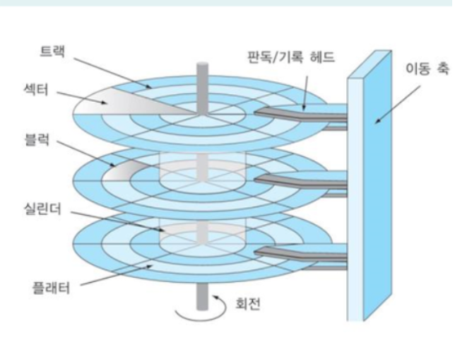
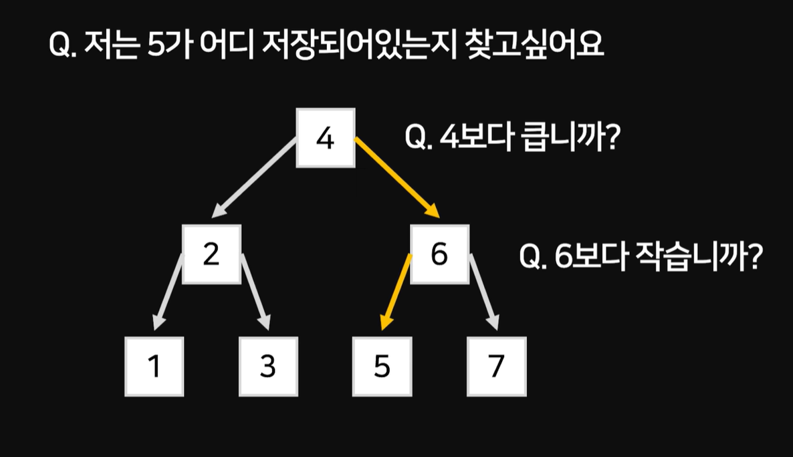
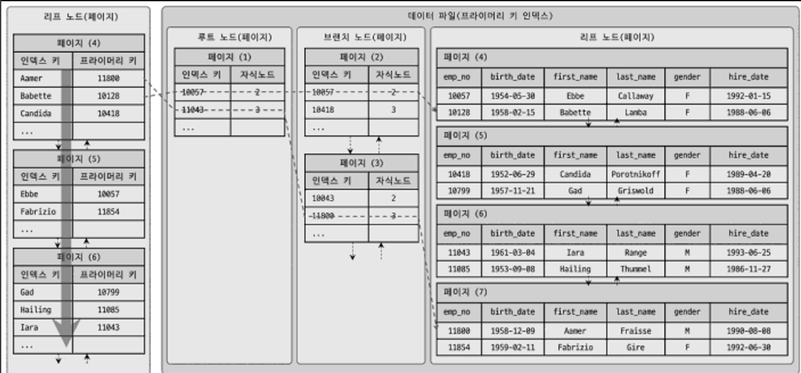
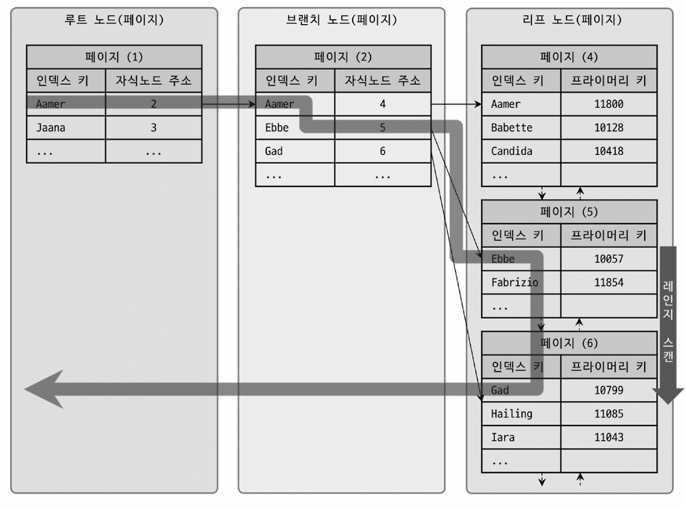

# [4주차] 08.인덱스 - 1

## 1. 디스크 읽기 방식

> 데이터베이스의 성능 튜닝은 어떻게 디스크 I/O를 줄이느냐가 관건일때가 상당히 많다.
> 

- 랜덤 I/O
    - 특정 레코드나 데이터 블록을 찾기 위해 인덱스를 탐색하는 경우
- 순차 I/O
    - 테이블의 모든 레코드를 스캔하는 SELECT 쿼리를 실행하는 경우

**`→ 순차 I/O는 랜덤 I/O 보다 거의 3배 정도 빠르다고 볼 수 있다.`** 

## 2. 인덱스

> 데이터를 `검색` 하기위해 주어진 순서로 미리 `정렬` 해서 보관하기 위함
> 

**`→ 결론적으로 데이터의 저장(CUD) 성능을 희생하고 그 대신 데이터의 읽기 속도를 높이는 기능`** 

인덱스를 역할별로 구분해 본다면 다음과 같이 구분할 수 있다.  

- 프라이머리 키
    - 그 레코드를 대표하는 칼럼의 값으로 만들어진 인덱스
- 세컨더리 인덱스
    - 프라이머리 키를 제외한 나머지 모든 인덱스

주 사용 알고리즘은 대표적으로 **B-Tree 인덱스**와 **Hash 인덱스**로 구분할 수 있다. 

- B-Tree 알고리즘
    - 칼럼의 값을 변형하지 않고 원래의 값을 이용해 인덱싱하는 알고리즘
- Hash 인덱스 알고리즘
    - 칼럼의 값으로 해시값을 계산해 인덱싱하는 알고리즘, 매우 빠른 검색 지원
    - 값의 일부 검색 및 범위 검색에는 사용할 수 없음

## 3. B-Tree 인덱스

**Binary Tree(이진 트리)**

**B-Tree → `Binary (x) , Balanced (o)`**

**B+Tree → `range search (범위 검색)에 강한 구조`** 

### 구조 및 특성

- 인덱스의 리프 노드에는 **실제 데이터 레코드를 찾아가기 위한 주솟값**을 가지고 있다.
- **InnoDB 테이블은 프라이머리 키를 주소처럼 사용하기 때문에, 논리적인 주소를 가진다.**

**`→ 세컨더리 인덱스 검색시, 프라이머리 키를 저장하고 있는 B-Tree 에서 다시 한 번 더 검색 필요`**

### 인덱스 키 추가 및 삭제, 검색

- 키 추가 : 리프 노드가 꽉 차서 리프 노드가 분리될 경우, 상위 브랜치 노드까지 처리해야하기 때문에, 상대적으로 쓰기 작업에 비용이 많이 든다.
- 키 삭제 : 리프 노드를 찾아 삭제 마크만 하면 작업이 완료된다.
- 키 변경 : 기존 인덱스 키 값을 삭제한 후 새로운 인덱스 키 값을 추가하는 방식으로 처리된다.

- 키 검색
    - B-Tree의 루트 노드부터 시작해 브랜치 노드를 거쳐 최종 리프 노드까지 이동하면서 비교 작업을 수행하는 `트리 탐색` 을 수행
    - B-Tree 인덱스를 이용한 검색은 **100%일치 (=) 또는 값의 앞부분 일치, 부등호 비교 조건**에서 사용 가능

### 성능 영향 요소

1. 인덱스 키 값의 크기
    - 크기가 클 수록 페이지를 많이 생성하게 되고, 성능이 저하된다.
2. B-Tree 깊이
    - 깊이가 깊을수록 랜덤 I/O가 늘어나 성능이 저하된다.
    - 하지만 사용자가 직접 제어할 방법은 없고, 깊이가 5단계 이상까지 깊어지는 경우는 흔치 않음
3. 선택도(Selectivity) == 기수성(Cardinality)
    - 인덱스 키 값의 유니크한 값의 수를 의미한다.
    - 중복된 키 값이 많아지면 기수성은 낮아지고 동시에 선택도 또한 떨어진다. → 성능 저하
    - 평균 검색 건수가 늘어나고, 그만큼 비교 연산을 많이 해야 함
4. 읽어야 하는 레코드 건수
    - 인덱스를 통해 레코드 1건을 읽는 것이 테이블에서 직접 레코드 1건을 읽는 것 보다 **4~5배 정도 비용이 더 많이 드는 작업**으로 예측한다.
    - 이 때문에, DB는 **전체 테이블 레코드의 20~25%를 넘어서면** 인덱스를 사용하지 않고 테이블을 모두 직접 읽어서 필터링 방식으로 처리한다.

### 인덱스 스캔

1. **Index Range Scan**
    - 인덱스 사용에 있어서 가장 빠른 방법이다.
    - 인덱스 레인지 스캔은 검색해야 할 인덱스의 범위가 결정됐을 때 사용하는 방식이다. 검색을 시작할 리프 노드를 선택하고, 필요로한 마지막 리프 노드에 닿을 때까지 순차적으로 인덱스를 읽는 방식이다.
    
    `ex) SELECT * FROM employees WHERE first)name BETWEEN ‘Ebbe’ AND ‘Gad’`
    
    
    

1. **Index Full Scan**
    - 인덱스 레인지와 다르게 인덱스를 처음부터 끝까지 모두 읽는 방식.
    - 대표적으로 쿼리의 조건절에 사용된 칼럼이 어떤 인덱스에 존재하나 **첫 번째 칼럼이 아닌 경우** 사용된다. 테이블 풀 스캔으로 전체 데이터를 스캔하는 것보다 인덱스 테이블을 스캔하는 것이 비용이 덜 들기 때문이다.
    
    
    

1. **Loose Index Scan**
    - 듬성듬성하게 인덱스를 읽는 방식으로, 중간에 필요하지 않는 인덱스 키 값은 무시하고 다음으로 넘어가는 형태이다.
    - 일반적으로 `GROUP BY` 또는 `MAX()`, `MIN()` 함수를 최적화 하는 경우 사용된다.
    - 인덱스 레인지 스캔과 인덱스 풀 스캔은 반대로 Tight Index Scan 으로 분류한다.
    
    
    

1. **Index Skip Scan**
    - 인덱스 스킵 스캔은 인덱스 칼럼 중 후행 열을 사용하는 쿼리에 최적화하는 방식이다.
    - 옵티마이저가 gender 칼럼을 건너뛰어서 birth_date 칼럼만으로도 인덱스 검색이 가능하게 해주는 방식이다.
    - 루스 인덱스 스캔은 `GROUP BY` 작업을 처리하기 위한 경우에만 사용하지만,
    - 인덱스 스킵 스캔은 where 조건절의 검색을 위해 사용 가능하도록 용도가 훨씬 넒어졌다.
    
    
    

### 다중 칼럼(Multi-column) 인덱스

<aside>
💡

**다중 칼럼 인덱스에서는 인덱스 내에서 각 컬럼의 위치(순서)가 상당히 중요하다.** 

**인덱스의 두 번째 칼럼은 첫 번째 칼럼에 의존해서 정렬되어 있다. (Left-most)**

</aside>

### 인덱스의 정렬과 스캔 방향

- 쿼리의 정렬이 실제 내림차순인지 오름차순인지와 관계 없이 인덱스를 읽는 순서만 변경하여 해결할 수 있다.
- 하지만 역순 정렬 쿼리가 정순 정렬 쿼리보다 **약 28.9% 더 시간이 걸릴 수 있다.**
- InnoDB에서 역순 스캔이 느린 이유는 페이지 잠금이 정순 스캔에 적합한 구조이며, 페이지 내의 인덱스 레코드는 단방향으로만 연결된 구조이기 때문이다.

### 인덱스의 가용성과 효율성

<aside>
💡

**1. 선택도가 높은 컬럼을 선두 컬럼에 배치해라. → 유니크한 값의 수** 

**2. 비교 컬럼은 선두 컬럼에, 범위 컬럼은 뒤쪽 컬럼에 배치해라.**

</aside>

- 다중 칼럼 인덱스에서 **각 칼럼의 순서**와, **사용 조건이 동등 비교인지 범위 조건인지**에 따라 효율이 달라진다.

`ex) SELECT * FROM dept_emp WHERE dept_no=’d002’ AND emp_no ≥ 10114;` 

- `case A) INDEX (dept_no, emp_no)`
- `case B) INDEX (emp_no, dept_no)`

→ case A : **작업 범위 결정 조건** 으로 작용

→ case B : `dept_no='d002'` 이 체크 조건(필터링 조건) 으로 작용

`ex) SELECT * FROM employees WHERE first_name LIKE ‘%mer’`

→ 문자열 역시 왼쪽 값(Left-most) 기준으로 정렬되기 때문에 인덱스가 먹히지 않음

**가용성과 효율성 판단**

: 다음 조건에서는 작업 범위 결정 조건으로 사용할 수 없다. 

- NOT-EQUAL로 비교된 경우
- LIKE ‘%??’ (뒷부분 일치) 형태로 비교된 경우
- 내장함수나 다른 연산자로 인덱스 칼럼이 변형된 경우
- NOT-DETERMINISTIC 속성의 내장함수가 비교 조건에 사용된 경우
- 데이터 타입이 서로 다른 비교
- 문자열 데이터 타입의 콜레이션이 다른 경우

<aside>
💡

MySQL 에서는 `NULL` 값도 인덱스에 저장된다. 그래서 IS NULL 과 같은 조건도 인덱스를 사용한다.

</aside>