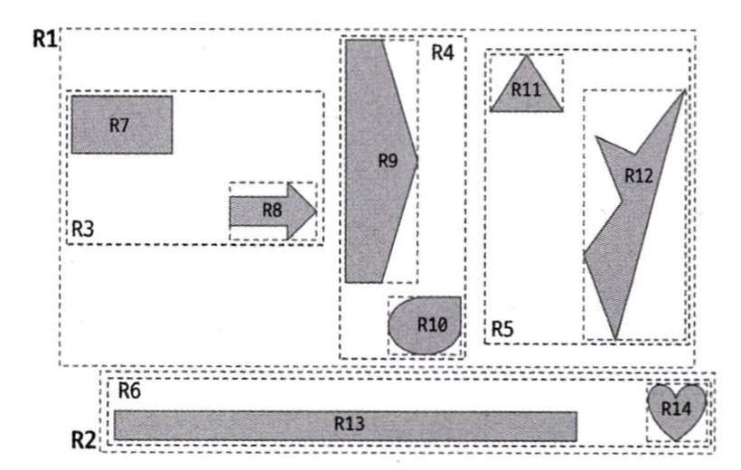

# [5주차] 08.인덱스 - 2

## R-Tree 인덱스

공간 인덱스(Spatial Index)는 R-Tree 인덱스 알고리즘을 이용해 2차원의 데이터를 인덱싱하고 검색하는 목적의 인덱스

- MySQl 의 `Geometry` 타입을 활용하여 도형의 저장이 가능
- 해당 도형을 감싸는 최소 크기의 사각형 (MBR : Minimum Bounding Rectangle)들의 포함 관계를 사용
    
    
    
- 좌표 시스템에 기반을 둔 정보에 대해 모두 적용 가능
- `ST_Contains()` 또는 `ST_Within()` 함수를 사용해 거리 기반 검색 시에 사용
    
    > 반경 nKm 를 그리는 원을 포함한 MBR 로 포함 관계를 수행하니 유의
    > 

## 전문 검색 인덱스

문서 전체에 대한 분석과 검색을 위한 인덱싱 알고리즘을 전문 검색(Full Text search) 인덱스 라고 한다. 

- 어근 분석 알고리즘
    - 불용어 처리와 어근 분석 과정을 거쳐 색인 작업을 수행함
- n-gram 알고리즘
    - 단순히 키워드를 검색해내기 위한 인덱싱 알고리즘이며, 본문을 n 글자씩 잘라서 인덱싱하는 방법
- 불용어 처리 관련 경로는 `my.cnf` 의 `ft_stopword_file` 를 커스텀해주면 된다.
- 전문 검색 인덱스를 사용하려면 반드시 다음과 같은 구문으로 쿼리를 작성해야 한다.
    
    ```sql
    mysql> SELECT * FROM tb_test
    			WHERE MATCH(doc_body) AGAINST('애플' IN BOOLEAN MODE);
    ```
    

## 함수 기반 인덱스

칼럼의 값을 변형해서 만들어진 값에 대해 인덱스를 구축해야 할 때 사용하는 인덱스이다.

- 가상 칼럼을 이용한 인덱스
    - 사용자가 칼럼 값을 변형한 임시 칼럼을 만들고, 해당 칼럼에 인덱스를 직접 작용
- 함수를 이용한 인덱스
    - 인덱스에 함수를 적용하여 테이블의 구조를 변경하지 않고 인덱스를 생성

> 가상 칼럼(Virtual Column)을 이용한 방법과 직접 함수를 이용한 함수 기반 인덱스는 내부적으로 동일한 구현 방법을 사용하므로, 둘의 성능 차이는 발생하지 않는다.
> 

## 멀티 밸류 인덱스

하나의 데이터 레코드가 여러 개의 키 값을 가질 수 있는 형태의 인덱스로, JSON의 배열 타입의 필드에 저장된 원소(Element)들과 같은 곳에서 적용할 수 있는 인덱스이다.

- 멀티 밸류 인덱스를 활용하기 위해, 반드시 다음 함수들을 이용해서 검색해야 한다.
    - `MEMBER OF()`
    - `JSON_CONTAINS()`
    - `JSON_OVERLAPS()`

```sql
CREATE INDEX mx_creditscores ON user ((CAST(credit_info->'$.credit_scores' AS UNSIGNED ARRAY)));

...

SELECT * FROM user WHERE 360 MEMBER OF(credit_info->'$.credit_scores');
```

## 클러스터링 인덱스

클러스터링 `(범주화)` 인덱스는 테이블의 프라이머리 키에 대해서만 적용되는 내용이다. 즉, 프라이머리 키 값이 비슷한 레코드끼리 묶어서 저장하는 것을 클러스터링 인덱스라고 표현한다. 


<aside>
💡

세컨더리 인덱스의 리프노드 → PK 값

클러스터링 인덱스의 리프노드 → 실제 row data

</aside>

테이블의 레코드가 프라이머리 키 값으로 정렬되어 저장된 경우만 “클러스터링 인덱스” 또는 “클러스터링 테이블”이라고 한다. 클러스터링 키 설정으로는 다음과 같은 우선순위를 따른다. 

1. 프라이머리 키가 있으면 기본적으로 클러스터링 키로 선택
2. NOT NULL 옵션의 유니크 인덱스 중에서 첫 번째 인덱스를 클러스터링 키로 선택
3. 자동으로 유니크한 값을 가지도록 증가되는 칼럼을 내부적으로 추가한 후, 클러스터링 키로 선택

### 클러스터링 테이블 사용 시 주의사항

- 클러스터링 인덱스 키의 크기를 신경 쓰자.
    - 모든 세컨더리 인덱스는 프라이머리 키를 가지기 때문에 **프라이머리 키의 크기가 커지면 세컨더리 인덱스의 크기도 함께 커진다.**
- 프라이머리 키는 Auto-Increment보다는 업무적인 컬럼으로 생성하자.
- 프라이머리 키를 반드시 명시하자.
- **Auto-Increment로 프라이머리 키를 명시한 경우와 명시하지 않은 경우는 결국 같지만** 프라이머리 키를 명시한 경우에는 사용자가 사용할 수 있으므로 반드시 프라이머리 키를 명시하자.

## 유니크 인덱스

유니크는 인덱스라기보다는 제약 조건에 가깝다고 볼 수 있다. MySQL에서는 인덱스 없이 유니크 제약만 설정할 방법이 없다. 유니크 인덱스에서 NULL도 저장될 수 있는데, 이는 특정 값이 아니므로 2개 이상 저장될 수 있다. 

- 유니크 인덱스와 일반 세컨더리 인덱스의 읽기 성능은 거의 차이가 없다.
- 유니크 인덱스의 키 값을 쓸 때는 중복된 값이 있는지 없는지 체크하는 과정이 한 단계 더 필요하므로, 일반 세컨더리 인덱스의 쓰기보다 느리다.

## 외래키

MySQL에서 외래키는 InnoDB 스토리지 엔진에서만 생성할 수 있으며, 외래키 제약이 설정되면 자동으로 연관되는 테이블의 칼럼에 인덱스까지 생성된다. 

InnoDB의 외래키 관리에는 중요한 두 가지 특징이 있다. 

- 테이블의 변경이 발생하는 경우에만 잠금 경합이 발생한다.
- 외래키와 연관되지 않은 칼럼의 변겅은 최대한 잠금 경합을 발생시키지 않는다.

<aside>
💡

외래키의 특성 

INSERT : 자식 row 를 넣을 때 참조 대상 부모 확인

UPDATE : 외래키 칼럼 값을 바꿀 때 새 부모 존재 확인

DELETE : 부모를 지울 때 자식이 있으면 어떻게 할 지

| 옵션 | 동작 방식 | 특징 | 사용 상황 |
| --- | --- | --- | --- |
| **CASCADE** | 부모 행 삭제 시 자식 행도 함께 삭제 | 강한 연쇄 삭제 | 종속 데이터 완전 제거 |
| **SET NULL** | 부모 행 삭제 시 자식 FK 컬럼을 NULL로 설정 | 관계는 끊되 데이터는 유지 | optional 관계 |
| **RESTRICT** | 자식이 존재하면 삭제 자체를 막음 | 즉시 제약 위반 에러 | 데이터 무결성 강제 |
| **NO ACTION** | RESTRICT와 동일하게 동작 (MySQL 기준) | 사실상 RESTRICT | 표준 호환용 |
| **SET DEFAULT** | 부모 삭제 시 기본값으로 설정 | ❌ MySQL 미지원 | (표준 SQL에만 존재) |

NO ACTION → 원래는 아무 조치를 취하지 않는 정책이지만, MySQL 에서는 RESTRICT 처럼 행동

</aside>
