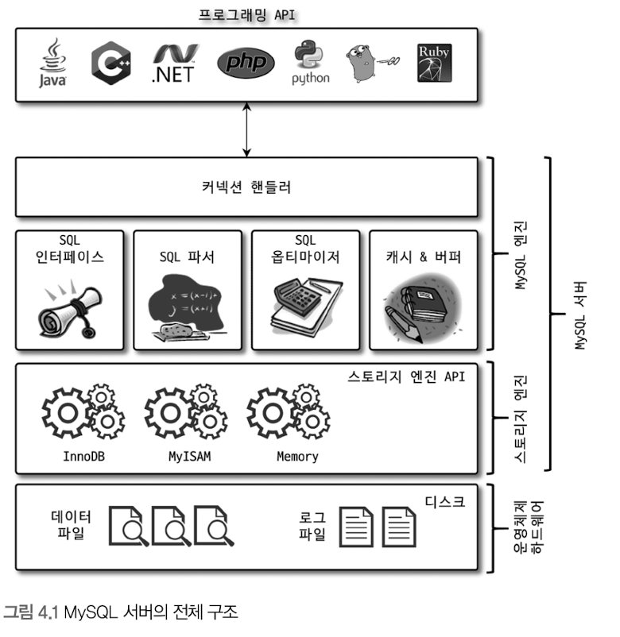
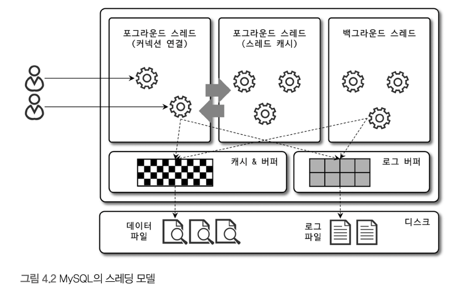
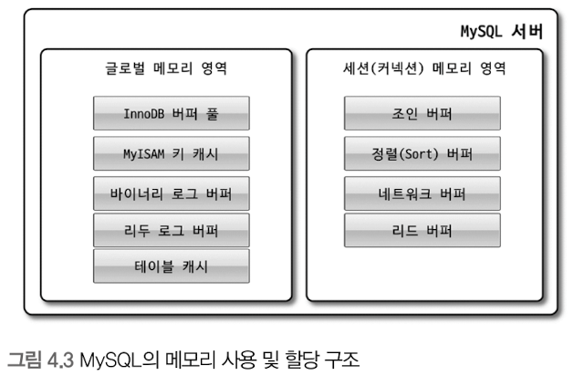
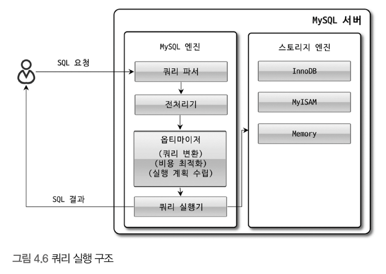
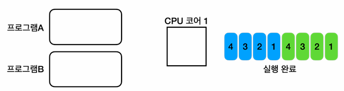

# [6주차] 04.아키텍처 - 1

# MySQL 엔진 아키텍처

> MySQL 서버는 크게 MySQL 엔진과 스토리지 엔진으로 구분할 수 있다.
> 

MySQL 엔진은 클라이언트로부터의 접속 및 쿼리 요청을 처리하는 커넥션 핸들러와 SQL 파서 및 전처리기, 쿼리의 최적화된 실행을 위한 옵티마이저가 중심을 이룬다. 

실제 데이터를 디스크 스토리지에 저장하거나 디스크 스토리지로부터 데이터를 읽어오는 부분은 스토리지 엔진이 전담한다. 

MySQL 서버에서 MySQL 엔진은 하나지만 스토리지 엔진은 여러개를 동시에 사용할 수 있다. 

### 핸들러 API

MySQL 엔진의 쿼리 실행기에서 데이터를 쓰거나 읽어야 할 때는 각 스토리지 엔진에 쓰기 또는 읽기를 요청하는데, 이러한 요청을 핸들러(Haldler) 요청이라 하고, 여기서 사용되는 API 를 핸들러 API라고 한다.  

### **MySQL 스레딩 구조**

MySQL 서버는 프로세스 기반이 아니라 스레드 기반으로 작동하며, 

크게 포그라운드 스레드와 백그라운드 스레드로 구분할 수 있다. 

#### 포그라운드 스레드(클라이언트 스레드)

포그라운드 스레드는 최소한 MySQL 서버에 접속된 클라이언트의 수 만큼 존재하며, 클라이언트 사용자가 사용을 종료하면 스레드 캐시로 되돌아간다.

InnoDB 테이블은 데이터 버퍼나 캐시까지만 포그라운드 스레드가 처리하고, 나머지 버퍼로부터 디스크까지 기록하는 작업은 백그라운드 스레드가 처리한다. 

#### 백그라운드 스레드

여러 가지 작업이 백그라운드로 처리되지만, 그중 가장 중요한것은 로그 스레드와 쓰기 스레드 일 것이다. 

InnoDB에서는 INSERT, UPDATE, DELETE 쿼리로 데이터가 변경되는 경우 데이터가 디스크의 데이터 파일로 완전히 저장될 때까지 기다리지 않아도 된다. (버퍼링)

### 메모리 할당 및 사용 구조

- 글로벌 메모리 영역은 클라이언트 스레드의 수와 무관하게 하나의 메모리 공간만 할당되며, 모든 스레드에 의해 공유된다.
- 로컬 메모리 영역은 세션 메모리 영역이라고도 표현하며, MySQL 서버상에 존재하는 클라이언트 스레드가 쿼리를 처리하는 데 사용하는 메모리 영역이다.
    - 로컬 메모리는 각 클라이언트 스레드별로 독립적으로 할당되며 절대 공유되어 사용되지 않는다.

### 플러그인 스토리지 엔진 모델

MySQL 서버에서는 스토리지 엔진뿐만 아니라 다양한 기능을 플러그인 형태로 지원한다. 

### 컴포넌트

MySQL 8.0부터는 기존의 플러그인 아키텍처를 대체하기 위해 컴포넌트 아키텍처가 지원된다. 

### 쿼리 실행 구조

- 쿼리 파서 : 사용자 요청으로 들어온 쿼리 문장을 토큰으로 분리해 트리 형태의 구조로 만들어 내는 작업
- 전처리기 : 쿼리 문장에 구조적인 문제점이 있는지 확인한다.
- 옵티마이저 : 쿼리 문장을 저렴한 비용으로 가장 빠르게 처리할지를 결정하는 역할을 담당하며, DBMS의 두뇌에 해당한다고 볼 수 있다.

### 스레드 풀

---

# 추가 내용(스레드)

## 멀티태스킹과 멀티프로세싱

### 단일 프로그램 실행

- 프로그램의 실행이란 프로그램을 구성하는 코드를 순서대로 CPU에서 연산(실행)하는 일이다.
- 이때, 하나의 프로그램 안에 있는 코드를 모두 실행한 후에야 다른 프로그램의 코드를 실행 하는 것이 초기 컴퓨터의 단일 프로그램 환경이다.

### 멀티태스킹

- 이 방식은 CPU 코어가 프로그램A의 코드를 0.01초 정도 수행하다가 잠시 멈추고, 프로그램B의 코드를 0.01초 정도 수행한다. 그리고 다시 프로그램A의 이전에 실행중인 코드로 돌아가서 0.01초 정도 코드를 수행하는 방식으로 반복 동작한다.
- 이렇게 각 프로그램의 실행 시간을 분할해서 마치 동시에 실행되는 것 처럼 하는 기법을 시분할(Time Sharing, 시간 공유) 기법이라 한다. 해당 방식을 사용하면 여러 프로그램이 동시에 실행되는 것 처럼 느낄 수 있다.
- 이렇게 하나의 컴퓨터 시스템이 동시에 여러 작업을 수행하는 능력을 멀티태스킹(Multitasking)이라 한다.

### 멀티프로세싱

CPU 코어가 둘 이상이면 어떻게 될까? 

- 멀티프로세싱(Multiprocessing)은 컴퓨터 시스템에서 둘 이상의 프로세서(CPU 코어)를 사용하여 여러 작업을 동시에 처리하는 기술을 의미한다. 멀티프로세싱 시스템은 하나의 CPU 코어만을 사용하는 시스템보다 동시에 더 많은 작업을 처리할 수 있다.

## 프로세스와 스레드

### 프로세스

- 프로그램을 실행하면 프로세스가 만들어지고 프로그램이 실행된다. 이렇게 운영체제 안에서 실행중인 프로그램을 프로세스라 한다. 
process is program in runnung
- 다시 말하면, 프로세스는 실행 중인 프로그램의 인스턴스이다.
- 자바로 비유하자면 클래스는 프로그램이고, 인스턴스는 프로세스이다.

**프로세스의 메모리 구성**

- **코드 섹션** : 실행할 프로그램의 코드가 저장되는 부분
- **데이터 섹션** : 전역 변수 및 정적 변수가 저장되는 부분(그림에서 기타 영역)
- **힙 (Heap)** : 동적으로 할당되는 메모리 영역
- **스택 (Stack)** : 메서드(함수) 호출 시 생성되는 지역 변수와 반환 주소가 저장되는 영역(스레드에 포함)

### 스레드 (Thread)

**프로세스는 하나 이상의 스레드를 반드시 포함한다.**

스레드는 프로세스 내에서 실행되는 작업의 단위이다. 한 프로세스 내에서 여러 스레드가 존재할 수 있으며, 이들은 프로세스가 제공하는 동일한 메모리 공간을 공유한다. 스레드는 프로세스보다 단순하므로 생성 및 관리가 단순하고 가볍다. 

- **단일 스레드** : 한 프로세스 내에 하나의 스레드만 존재
- **멀티 스레드** : 한 프로세스 내에 여러 스레드가 존재

**메모리 구성**

- **공유 메모리** : 같은 프로세스의 코드 섹션, 데이터 섹션, 힙(메모리)은 프로세스 안의 모든 스레드가 공유한다.
- **개별 스택** : 각 스레드는 자신의 스택을 갖고 있다.

### 자바 메모리 구조

- 메서드 영역(Method Area): 메서드 영역은 프로그램을 실행하는데 필요한 공통 데이터를 관리한다. 이 영역은 프로그램의 모든 영역에서 공유한다.
    - 클래스 정보, static 영역, 런타임 상수 풀 등이 존재한다.
- 스택 영역(Stack Area): 자바 실행 시, 하나의 실행 스택이 생성된다. 각 스택 프레임은 지역 변수, 중간 연산 결과, 메서드 호출 정보 등을 포함한다.
- 힙 영역(Heap Area): 객체(인스턴스)와 배열이 생성되는 영역이다.

> **참고** : 스택 영역은 더 정확히는 각 스레드별로 하나의 실행 스택이 생성된다. 따라서 스레드 수 만큼 스택이 생성된다. 지금은 스레드를 1개만 사용하므로 스택도 하나이다. 이후 스레드를 추가할 것인데, 그러면 스택도 스레드 수 만큼 증가한다.
> 

### 멀티태스킹 vs 멀티프로세싱 vs 멀티스레딩 차이점 정리

| 구분 | **멀티태스킹 (Multitasking)** | **멀티프로세싱 (Multiprocessing)** | **멀티스레딩 (Multithreading)** |
| --- | --- | --- | --- |
| **정의** | 하나의 CPU에서 여러 개의 작업(Task)을 빠르게 번갈아 실행하여 동시에 실행되는 것처럼 보이게 하는 기법 | 여러 개의 CPU(Core)를 사용하여 여러 개의 프로세스를 병렬로 실행하는 방식 | 하나의 프로세스 내에서 여러 개의 스레드를 생성하여 실행하는 방식 |
| **작동 방식** | OS가 빠르게 **CPU 시간을 분할(Time-Slicing)** 하여 여러 작업을 수행하는 것처럼 보이게 함 | **여러 개의 프로세스가 독립적으로 실행됨** (각 프로세스는 별도의 메모리 공간을 가짐) | **하나의 프로세스 내부에서 여러 스레드가 실행**되며, 메모리를 공유함 |
| **CPU 사용 방식** | 단일 CPU를 빠르게 전환하여 여러 작업을 처리하는 방식 | 다중 CPU(멀티코어)를 활용하여 병렬 처리 | 하나의 프로세스에서 여러 스레드가 실행되며, CPU 코어를 공유 |
| **메모리 관리** | 각 작업이 독립적인 메모리 공간을 사용 | 각 프로세스가 독립적인 메모리 공간을 사용 (IPC 필요) | 모든 스레드가 **동일한 프로세스 메모리 공간을 공유** |
| **병렬 실행 여부** | ❌ (실제로는 순차 실행, 단 사용자 입장에서 병렬처럼 보임) | ✅ (여러 CPU에서 실제 병렬 실행) | ✅ (스레드 단위로 병렬 처리 가능) |
| **문맥 전환 비용(Context Switching)** | 높음 (프로세스 간 컨텍스트 스위칭 발생) | 높음 (여러 프로세스를 관리해야 하므로) | 낮음 (같은 프로세스 내에서 전환되므로 효율적) |
| **대표적인 예시** | - Windows, macOS, Linux에서 여러 프로그램(브라우저, 워드, 음악 플레이어 등) 실행 | - 데이터베이스 서버(MySQL, PostgreSQL)  - 병렬 컴퓨팅(과학 계산, AI 학습) | - 웹 서버(Apache, Nginx)  - 게임 엔진(물리 연산, AI, 네트워크) |
| **장점** | - 사용자가 여러 작업을 동시에 수행하는 것처럼 보이게 함 | - 병렬 처리로 성능 향상 가능 (CPU 활용 극대화) | - 프로세스보다 가벼워서 컨텍스트 스위칭 비용이 적음 |
| **단점** | - 실제 병렬 처리가 아님 (CPU를 공유) | - 프로세스 간 데이터 공유가 어려움 (IPC 필요) | - 스레드 간 동기화 문제 (Race Condition, Deadlock 발생 가능) |

### 스레드 풀

- 스레드를 관리하는 스레드 풀(스레드가 모여서 대기하는 수영장 풀 같은 개념)에 스레드를 미리 필요한 만큼 만들어둔다.
- 작업 요청이 오면 스레드 풀에서 이미 만들어진 스레드를 하나 조회하여 작업을 처리한다.
- 작업을 완료한 스레드는 종료하는게 아니라, 다시 스레드 풀에 반납한다. 반납한 스레드는 이후에 다시 재사용 될 수 있다.
- 이렇게 스레드 풀이라는 개념을 사용하면 스레드를 재사용할 수 있어서, 재사용시 스레드의 생성 시간을 절약할 수 있다. 그리고 스레드 풀에서 스레드가 관리되기 때문에 필요한 만큼만 스레드를 만들 수 있고, 또 관리할 수 있다.

