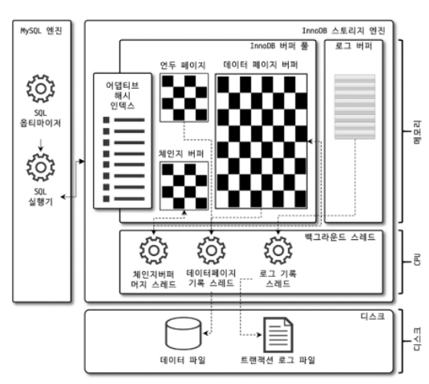
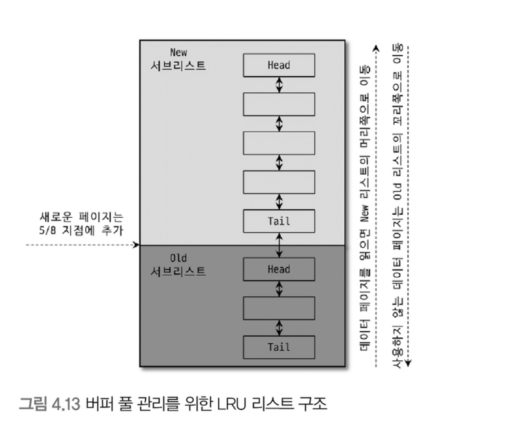

# [7주차] 04.아키텍처 - 2

# InnoDB 스토리지 엔진 아키텍처

- InnoDB 스토리지 엔진은 레코드 기반의 잠금을 제공하며, 그 때문에 높은 동시성 처리가 가능하고 안정적이며 성능이 뛰어나다.

**프라이머리 키에 의한 클러스터링**

- InnoDB의 모든 테이블은 기본적으로 프라이머리 키를 기준으로 클러스터링되어 저장된다.
- 즉, 프라이머리 키 값의 순서대로 디스크에 저장된다는 뜻이며, 모든 세컨더리 인덱스는 레코드의 주소 대신 프라이머리 키의 값을 논리적인 주소로 사용한다.

**MVCC(Multi Version Concurrency Control)**

- MVCC의 가장 큰 목적은 잠금을 사용하지 않는 일관된 읽기를 제공하는 데 있다. InnoDB는 언두 로그(Undo log)를 이용해 이 기능을 구현한다.

**잠금 없는 일관된 읽기(Non-Locking Consistent Read)**

- InnoDB 스토리지 엔진은 MVCC 기술을 이용해 잠금을 걸지 않고 읽기 작업을 수행한다.
- 즉, INSERT와 연결되지 않은 순수한 읽기(SELECT) 작업은 다른 트랜잭션의 변경 작업과 관계 없이 항상 잠금을 대기하지 않고 바로 실행된다.

**자동 데드락 감지**

- InnoDB 스토리지 엔진은 내부적으로 잠금이 교착 상태에 빠지지 않았는지 체크하기 위해 잠금 대기 목록을 그래프(Wait-for List) 형태로 관리한다.
- 주기적으로 잠금 대기 그래프를 검사해 교착 상태에 빠진 트랜잭션들을 찾아서 그중 하나를 강제 종료한다. 이때 언두 로그 레코드를 더 적게 가진 트랜잭션이 일반적으로 롤백의 대상이 된다.

<aside>
💡

**참고**

매우 많은 트랜잭션을 동시에 실행하는 환경에서는 데드락 감지 스레드가 상당히 성능을 저하시킬 수 있다. 

만약 PK 또는 세컨더리 인덱스를 기반으로 매우 높은 동시성 처리를 요구하는 서비스가 있다면 `innodb_deadlock_detact` 를 비활성화해서 성능 비교를 해보는 것도 새로운 기회가 될 것이다.

</aside>

**자동화된 장애 복구**

- innodb_force_recovery 설정값 1부터 6까지 각 숫자 값으로 복구되는 장애 상황과 해결 방법을 다르게 제공한다.

## InnoDB 버퍼 풀

InnoDB 스토리지 엔진에서 가장 핵심적인 부분으로, **디스크의 데이터 파일이나 인덱스 정보를 메모리에 캐시**해 두는 공간이다. 

또한 **쓰기 작업을 지연시켜 일괄 작업으로 처리할 수 있게 해주는 버퍼** 역할도 같이 한다.

> 버퍼 풀의 역할 → 1) 읽기 캐싱 2) 쓰기 버퍼
> 

### 버퍼 풀의 구조

1. LRU List
    - 디스크로부터 한 번 읽어온 페이지를 최대한 오랫동안 InnoDB 버퍼 풀의 메모리에 유지하여 **디스크 읽기를 최소화하는 목적**
        
        
        
2. Flush List
    - 디스크로 동기화되지 않은 데이터를 가진 데이터를 가진 **더티 페이지의 변경 시점 기준의 페이지 목록**을 관리한다.
    - 데이터가 변경되면 InnoDB는 변경 내용을 리두 로그에 기록하고 버퍼 풀의 데이터 페이지에도 변경 내용을 반영한다.
3. Free List
    - InnoDB 버퍼 풀에서실제 사용자 데이터로 채워지지 않은 **비어 있는 페이지들의 목록**

<aside>
💡

클린 페이지(Clean Page) : 디스크에서 읽은 상태로 전혀 변경되지 않은채 버퍼 풀에 적재된 페이지

더티 페이지(Dirty Page) : INSERT, UPDATE, DELETE 로 변경된 데이터를 가진 페이지  

</aside>

### 버퍼 풀과 리두 로그

InnoDB 버퍼풀의 쓰기 버퍼링 기능을 향상시키려면 리두 로그와의 관계를 먼저 이해해야 한다. 

- 리두 로그 파일의 공간은 계속 순환되어 재사용되며, 이를 위해 재사용 가능 공간과 당장 재사용 불가능한 공간(Active Redo Log : 활성 리두 로그)으로 구분하여 관리한다.
- InnoDB 스토리지 엔진은 주기적으로 체크포인트 이벤트를 발생시켜 더티페이지를 디스크로 동기화하는데, 이 때의 LSN 간격을 Checkpoint Age 라고 한다. 이는 활성 리두 공간의 크기를 일컫는다.

> 버퍼 풀의 크기가 100GB 이하의 MySQL 서버에서는 리두 로그 파일의 크기를 대략 5~10GB 수준으로 선택하고 필요할 때 마다 조금씩 늘려가며 최적값을 선택하는 것이 좋다.
> 

<aside>
💡

**WAL (Write Ahead Log)**

데이터를 디스크에 기록하기 전에 먼저 기록되는 로그, 

MySQL 에서는 REDO LOG를 의미한다. 

</aside>

### 버퍼 풀 플러시

InnoDB 스토리지 엔진은 버퍼 풀에서 아직 디스크로 기록되지 않은 더티 페이지들을 성능상의 악영향 없이 디스크에 동기화 하기 위해 두 개의 플러시 기능을 백그라운드로 실행한다. 

- Flush_list 플러시
    - 플러시 리스트에서 오래전에 변경된 데이터 페이지 순서대로 디스크에 동기화
    - 어댑티브 플러시 알고리즘: 리두 로그의 증가 속도를 분석해서 적절한 수준의 더티 페이지가 버퍼 풀에 유지될 수 있도록 자동으로 디스크 쓰기를 실행
- LRU_list 플러시
    - LRU 리스트를 차례대로 스캔하며 더티 페이지는 디스크에 동기화하고, 클린 페이지는 즉시 프리 리스트로 페이지를 옮기며 새로운 페이지들을 읽어올 공간을 만듬

### 버퍼 풀 상태 백업 및 복구

- MySQL 서버를 셧다운 하기 전에 innodb_buffer-pool_dump_now 시스템 변수를 이용해 현재 InnoDB 버퍼 풀의 상태를 백업할 수 있다.
- 버퍼 풀의 백업과 복구를 자동화하려면 innodb_buffer_pool_dump_at_shutdown 과 innodb_buffer_pool_load_at_startup 설정을 넣어두면 된다.

## Double Write Buffer

InnoDB 스토리지 엔진의 리두 로그는 페이지의 변경된 내용만 기록하기 때문에, 페이지가 일부만 기록되는 현상(Partial-page or Torn-page)이 발생할 수 있다. 

이를 막기 위해 Double-Write 기법을 사용하는데, 이는 실제 데이터 파일에 변경 내용을 기록하기 전에 더티 페이지를 묶어서 한 번에 Double Write 버퍼에 기록한다. 

그리고 각 더티 페이지를 파일의 적당한 위치에 하나씩 랜덤으로 쓰기를 실행한다. 

Double Write 버퍼의 내용은 실제 데이터파일의 쓰기가 중간에 실패할 때만 원래의 목적으로 사용된다. 

SSD 처럼 랜덤 IO 와 순차 IO의 비용이 비슷한 저장 시스템에서는 Double Write를 비활성화 하는 방법도 있다. 

## 언두 로그

언두 로그의 데이터는 크게 두 가지 용도로 사용된다. 

- **트랜잭션 보장**
    - 트랜잭션이 롤백되면 트랜잭션 도중 변경된 데이터를 변경 전으로 복구하기 위해 사용
- **격리 수준 보장**
    - 서로 다른 커넥션에서 트랜잭션 격리 수준에 맞게 변경중인 레코드를 읽지 않고 언두 로그에 백업해둔 데이터를 읽어 반환한다.

 

대용량의 데이터를 처리하는 트랜잭션이거나, 트랜잭션이 오랜 시간 동안 실행될 때 언두 로그의 양이 급격히 증가할 수 있다.  

예전에는 한 번 증가한 언두 로그 공간은 다시 줄어들지 않아, 로그 크기에 주의를 기울여야 했다. 

지금은 다행히도 서버가 필요한 시점에 사용 공간을 자동으로 줄여주기도 한다. 

하지만 여전히 활성 상태의 트랜잭션이 장시간 유지되는 것은 성능상 좋지 않으므로, 언두 로그가 얼마나 증가했는지 항상 모니터링하는 것이 좋다.

- 언두 로그가 저장되는공간을 언두 테이블 스페이스(Undo Tablespace)라고 한다.
- 하나의 언두 테이블 스페이스는 1개 이상 128개 이하의 롤백 세그먼트를 가지며,
- 롤백 세그먼트는 1개 이상의 언두 슬롯(Undo Slot)을 가진다.

> 최근 버전부터, 언두 로그는 항상 별도 로그 파일에 기록되도록 개선되었다.
> 

## 체인지 버퍼

RDBMS에서 레코드가 INSERT되거나 UPDATE될 때는 데이터 파일을 변경하는 작업뿐 아니라 해당 테이블에 포함된 인덱스를 업데이트하는 작업도 필요하다. 

이때 사용하는 임시 메모리 공간을 체인지 버퍼라고 한다. 

중복 여부를 체크해야 하는 유니크 인덱스는 체인지 버퍼를 사용할 수 없다. 

## 어댑티브 해시 인덱스

InnoDB 스토리지 엔진에서 사용자가 자주 요청하는 데이터에 대해 자동으로 생성하는 인덱스이며, B-Tree 검색 시간을 줄여주기 위해 도입된 기능이다. 

- 어댑티브 해시 인덱스가 성능 향상에 크게 도움이 되지 않는 경우
    - 디스크 읽기가 많은 경우
    - 특정 패턴의 쿼리가 많은 경우(조인이나 `LIKE` 패턴 검색)
    - 매우 큰 데이터를 가진 테이블의 레코드를 폭넓게 읽는 경우
- 성능 향상에 많은 도움이 되는 경우
    - 디스크의 데이터가 InnoDB 버퍼 풀 크기와 비슷한 경우(디스크 읽기가 많지 않은 경우)
    - 동등 조건 검색(동등 비교와 `IN` 연산자)이 많은 경우
    - 쿼리가 데이터 중에서일부 데이터에만 집중되는 경우