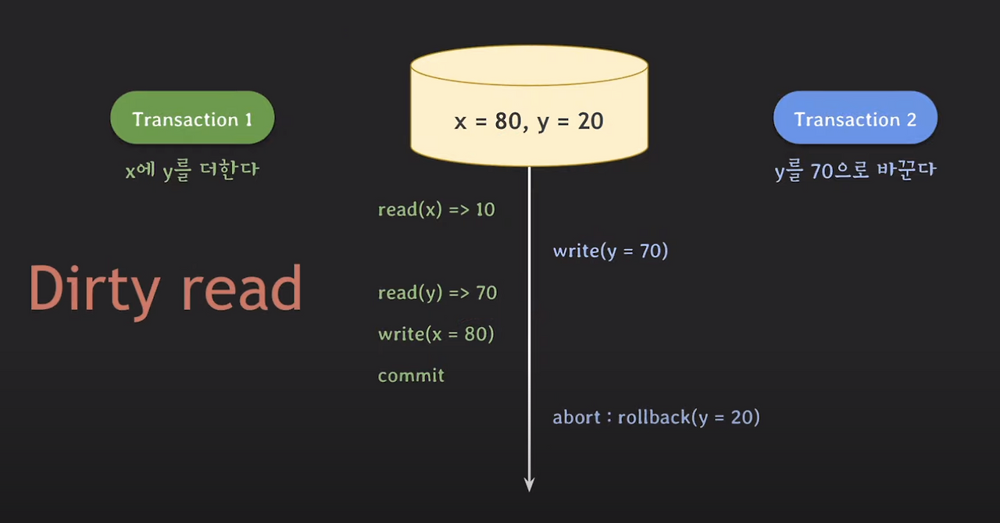
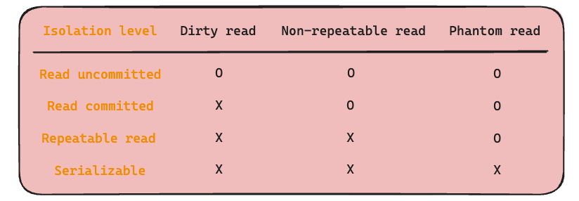

# 3주차(트랜잭션과 잠금) intro

추가 일시: 2026년 4월 6일 오후 6:13
강의: 스터디
참고 자료: https://velog.io/@semi-cloud/MySQL-%ED%8A%B8%EB%9E%9C%EC%9E%AD%EC%85%98%EA%B3%BC-%EC%9E%A0%EA%B8%88Lock-%EA%B7%B8%EB%A6%AC%EA%B3%A0-%ED%8A%B8%EB%9E%9C%EC%9E%AD%EC%85%98-%EA%B2%A9%EB%A6%AC-%EB%A0%88%EB%B2%A8, https://inpa.tistory.com/entry/MYSQL-%F0%9F%93%9A-%ED%8A%B8%EB%9E%9C%EC%9E%AD%EC%85%98Transaction-%EC%9D%B4%EB%9E%80-%F0%9F%92%AF-%EC%A0%95%EB%A6%AC, https://haburu23.tistory.com/25

# 💠 트랜잭션

### 1. 트랜잭션이란?

> 여러 개의 데이터베이스 작업을 하나의 논리적인 작업 단위로 묶어서 처리하는 것.
> 

ex) 간단하게 예를들면, 계좌이체라는 작업은 인출과 입금이라는 2개의 작업 모두 데이터의 정합성을 위해 필수적으로 수행되야한다. 그래서 하나의 작업 단위로 묶어서 수행한다..

**※**데이터 정합성: 데이터들 사이에 **논리적인 모순이 없는 상태**

→ 인출은 했는데, 입금이 안됨 or 인출을 안했는데, 입금이 됨

### 2. 트랜잭션은 왜 필요한가?

트랜잭션은 작업의 완전성을 보장하기 위해 필요하다.

즉, 여러 작업이 모두 정상적으로 수행되거나, 하나라도 실패하면 전체 작업을 취소하여 데이터의 신뢰성을 유지한다.

**※**완전성**:** 데이터의 생명주기 동안 데이터의 무결성을 유지하며 의도치 않게 변경되거나 손상되지 않은 상태 

**※**데이터 무결성: 데이터가 올바르기(정확, 일관, 완전) 위한 규칙 → 내가 믿고 쓸 수 있기 위해

- 비지니스 무결성: 서비스 성격에 따라 데이터 규칙을 정한다. 상품을 살 때 인당 개수 제한
- 개체 무결성: 키 값이 중복(PK)이거나 null이면 안된다. 학생 번호는 반드시 존재해야 한다.
- 도메인 무결성: 상식적인 기준에 맞춰서 규칙을 정한다.  나이는 음수가 될 수 없음
- 참조 무결성: 유저 - 주문 2개의 테이블이 있다고 가정하면, 주문한 회원은 실제 회원 테이블에 있어야 함.

### 3. 트랜잭션의 4가지 특징

1. **원자성(Atomicity)**
트랜잭션에 포함된 작업은 모두 수행되거나 모두 취소되어야 한다.
2. **일관성(Consistency)**
트랜잭션 수행 전과 수행 후에 데이터는 항상 정해진 규칙을 만족해야 한다.
3. **격리성(Isolation)**
동시에 실행되는 트랜잭션들은 서로의 작업에 함부로 간섭할 수 없다.
4. **지속성(Durability)**
성공적으로 완료된 트랜잭션의 결과는 시스템 장애가 발생해도 영구적으로 보존되어야 한다.
    
    → COMMIT이 끝나면, 그 결과는 DB에 확정 저장된다.
    

### 4. 트랜잭션으로 묶는 기준

> 코드 설계자가 작업의 연관 관계를 보고 묶는 것 - 코드 설계자가 정함
> 

→ 트랜잭션을 통해 처리하고 싶은 결과에 따라 묶는게 달라짐.

따라서, 함께 성공하거나 함께 실패해야 의미가 있는 경우 하나의 트랜잭션으로 묶는다.

### 4.1. 트랜잭션 묶는 것 주의 사항

프로그램 코드 상에서 트랜잭션으로 묶을 때, 트랜잭션의 범위를 최소화 하는것이 권장된다.

**WHY? DBMS 서버가 높은 부하 상태로 빠지거나 위험한 상태에 빠지는 경우를 막기 위해**

ex)위험한 경우의 예시(realmysql p.159)

1. 트랜잭션을 하기 위해서는, 데이터베이스 커넥션을 생성해야함
    
    커넥션 생성과 반납 사이의 작업이 많아질수록 커넥션을 소유하는 시간이 길어짐.
    
    but 커넥션의 개수는 제한적이기 때문에, 소유가 길어지면 여유 커넥션의 개수가 줄어들고,
    
    어느순간 커넥션을 생성하는데 시간이 걸리는 상황이 발생할 수 있다.
    
2. DBMS 서버 외의 외부 서버와 통신하는 작업이 트랜잭션안에 포함되어 있을 때, 외부 서버와 통신이 안되는 상황이 됐을 경우 웹 서버뿐만 아니라, DBMS 서버까지 위험해진다.

---

# 💠 잠금

### 1. 잠금이란?

**잠금(Lock)** 은

여러 커넥션이 **동시에 같은 데이터(레코드나 테이블)에 접근할 때**,

데이터가 꼬이거나 충돌하지 않도록 **접근 순서를 제어하는 기능**이야.

> **“지금 이 데이터는 내가 작업 중이니까, 다른 사람은 잠깐 기다려.”**
> 

### 2. 잠금은 왜 필요한가?

데이터베이스에는 보통 여러 사용자가 동시에 접속한다.

그래서 여러 커넥션이 **같은 레코드나 테이블을 동시에 수정**하는 문제가 발생 가능.

ex)예를 들면:

- 같은 계좌 잔액을 동시에 수정
- 같은 상품 재고를 동시에 감소
- 같은 게시글 내용을 동시에 변경

따라서

- 값이 덮어써지거나
- 계산이 틀어지거나
- 데이터가 논리적으로 맞지 않게 될 수 있다.

→ 이런 문제를 막아서 데이터 무결성을 지키기 위해 잠금을 사용한다.

### 3. 잠금의 핵심 역할

1.  **동시에 같은 데이터를 수정하지 못하게 함**
    
    한 커넥션이 어떤 데이터를 수정 중이면
    
    다른 커넥션은 바로 수정하지 못하고 기다리게 할 수 있다.
    
2. **데이터 충돌을 막음**
    
    같은 값을 동시에 바꾸면 결과가 꼬일 수 있는데,
    
    잠금은 그런 충돌을 줄여준다.
    
3. **트랜잭션의 격리성을 도와줌**
    
    트랜잭션끼리 서로 함부로 간섭하지 못하게 해서
    
    안전한 처리가 가능하다.
    
    ```sql
    START TRANSACTION;
    
    SELECT stock
    FROM product
    WHERE id = 1
    FOR UPDATE;
    
    UPDATE product
    SET stock = stock - 1
    WHERE id = 1 AND stock > 0;
    
    COMMIT;
    ```
    
- `FOR UPDATE`가 걸리면 **같은 상품 행을 다른 커넥션이 동시에 수정하지 못하고 기다리게 됨**
- 그래서 여러 요청이 동시에 들어와도 **재고 값이 꼬이는 충돌을 줄일 수 있음**
- 또한 한 트랜잭션이 작업하는 동안 다른 트랜잭션이 함부로 끼어들기 어려워서 **격리성을 도와줌**

### 4. 잠금 종류

MySQL에서 사용하는 잠금은 크게 **MySQL 엔진 레벨**과 **스토리지 엔진 레벨**으로 나눌 수 있다.

MySQL 엔진 레벨의 잠금은 모든 스토리지 엔진에 영향을 미치지만, 스토리지 엔진 레벨의 잠금은 스토리지 엔진 간 상호 영향을 미치지 않는다.

#### 4.1 MySQL 엔진의 잠금

**글로벌 락**

한 세션에서 글로벌 락을 획득하면, **MySQL 서버 전체(다른 데이터베이스)에 존재하는 모든 테이블을 닫고 잠금**이 걸린다. 따라서 `SELECT` 문장을 제외한 `DDL(craete,alter,drop)/DML(select, insert, update, delete)` 문장을 실행하는 경우 락 해제 전까지 대기해야 한다.
→ 잠금 명령어:`FLUSH_TABLE_WITH_READ_LOCK`

- **DDL(Data Definition Language)**:  데이터 정의어, 틀을 다룸
→ 테이블, 구조, 설계
- **DML(Data Manipulation Language)**: 데이터 조작어, 내용을 다룸
→ 실제 데이터

**테이블 락**

테이블 락이란 **개별 테이블 단위로 설정되는 잠금**이며, 명시적 락과 묵시적 락으로 나뉜다.

1. 명시적 락: 명령어를 통해 락을 획득하고 해제한다. 

```sql
LOCK TABLES table_name [ READ | WRITE]
UNLOCK TABLES table_name [ READ | WRITE]
```

1. 묵시적 락: `MyISAM` 이나 `MEMORY` 테이블에 데이터를 변경하는 쿼리를 실행할 때 락이 걸리고, 쿼리가 완료된 후 자동으로 해제된다.

**네임드 락**

`GET_LOCK()` 함수를 이용해 테이블이나 레코드와 같은 데이터베이스 객체 가 아닌 단순 **문자열에 대한 잠금**을 거는 것

**메타데이터 락**

테이블이나 뷰 등의 **데이터베이스 객체의 이름이나 구조를 변경**해야 할 때 묵시적(자동으로) 획득하는 잠금이다.

#### **4.2 InnoDB 스토리지 엔진 잠금**

**공유 락**

데이터를 읽는 동안 다른 트랜잭션의 수정을 막는 읽기 중심의 잠금

- 목적: 읽기 보호
- 다른 읽기: 가능
- 다른 쓰기: 불가

**베타 락**

데이터를 수정하는 동안 다른 트랜잭션의 접근을 제한하는 쓰기 중심의 잠금

- 목적: 수정 보호
- 다른 읽기/쓰기: 제한

**레코드 락**
테이블 전체가 아니라 **특정 행(row) 하나**를 잠그는 락

**갭 락**

**레코드 자체가 아니라 레코드 사이의 빈 구간**을 잠근다.

다른 트랜잭션이 그 사이에 새 데이터를 끼워 넣어서

조회 결과가 달라지는 걸 막기 위해서이다.

---

# 💠 격리 수준

### 1. 격리 수준이란?

여러 트랜잭션이 동시에 처리될 때 특정 트랜잭션이 다른 트랜잭션에서 변경되거나 조회하는 데이터를 볼 수 있게 허용할지 말지를 결정하는 것이다.

### 2. 격리 수준을 사용하는 이유

격리 수준은 **동시에 여러 트랜잭션이 실행될 때 발생할 수 있는 데이터 이상 현상**을 제어하기 위해 사용한다.

→ **동시성 제어**를 할 때 사용

### 2.1 데이터 이상 현상

#### 2.1.1. Dirty Read

트랜잭션이 commit 하지 않은 데이터도 읽을 수 있다. 



#### 2.1.2. Non-repeatable read

하나의 트랜잭션 내에서 같은 데이터의 값이 달라짐


#### 2.1.3. Phantom read

하나의 트랜잭션 내에서 없던 데이터가 생김


### 3. 격리 수준 종류

격리 수준이 높을수록 더 안전하지만 동시성은 떨어질 수 있고

격리 수준이 낮을수록 동시성은 좋아지지만 이상 현상이 발생할 가능성이 커진다.

#### 3.1. READ UNCOMMITTED

가장 낮은 격리 수준이다.

> 다른 트랜잭션이 아직 커밋하지 않은 데이터도 읽을 수 있다.
> 

아직 확정되지 않은 데이터까지 읽을 수 있어서 **가장 위험하지만 동시성은 높다.**

---

#### 3.2. READ COMMITTED

> 커밋이 완료된 데이터만 읽을 수 있는 격리 수준이다.
> 

확정된 데이터만 읽기 때문에 READ UNCOMMITTED보다 안전하다.

하지만 같은 쿼리를 두 번 실행했을 때 결과가 달라질 수 있다.

---

#### 3.3. REPEATABLE READ

> 트랜잭션이 시작된 후 같은 데이터를 여러 번 읽어도 항상 같은 결과를 보장하려는 격리 수준이다.
> 

같은 행을 반복 조회할 때 결과가 바뀌지 않도록 보장한다.

MySQL InnoDB의 기본 격리 수준이다.

---

#### 3.4. SERIALIZABLE

가장 높은 격리 수준이다.

> 트랜잭션들을 순서대로 하나씩 실행하는 것처럼 처리한다.
> 

가장 안전하지만 동시성이 가장 낮다.

충돌 가능성을 거의 없애는 대신 성능 부담이 크다.

---

**요약**



---

### 잠금

- 동시성에 영향을 미침 → 어떤식으로? 제어로
- 동시성을 제어하기 위한 기능
- 여러 커넥션에서 동시에 동일한 자원(레코드나 테이블)을 요청할 경우 순서대로 한 시점에는 하나의 커넥션만 변경할 수 있게 해주는 역할을 한다.
    
    → 동시에 여러 요청이 들어오면 한 시점에 하나의 커넥션만 접근 가능
    

### 완전성

### 데이터 무결성

데이터가 올바르기(정확, 일관, 완전) 위한 규칙

- 비지니스 무결성: 서비스 성격에 따라 데이터 규칙을 정한다.
- 개체 무결성: 키 값이 중복이거나 null이면 안된다.
- 도메인 무결성: 상식적인 기준에 맞춰서 규칙을 정한다.
- 참조 무결성: 유저 - 주문 2개의 테이블이 있다고 가정하면, 유저가 있어야 주문 테이블에 레코드를 삽입할 수 있기 때문이다.

### 동시성

mysql 특성

### 격리 레벨

- 하나 또는 여러 트랜잭션 간의 작업 내용을 어떻게 공유하고 차단할 것인지 결정하는 레벨