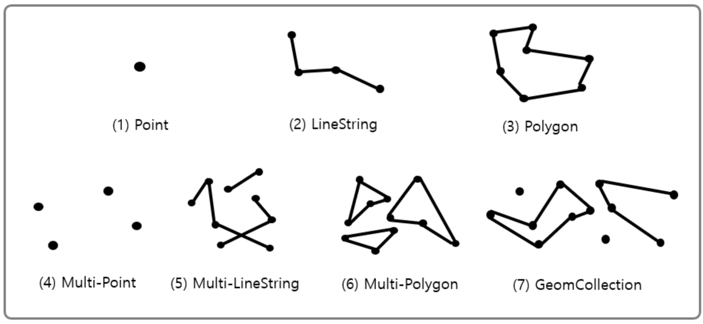

# 5주차(인덱스 2)

추가 일시: 2026년 4월 21일 오후 12:45
강의: 스터디

## 공간 데이터

Mysql에서는 위도, 경도와 같은 지리 정보를 저장할 수 있게 공간 데이터 타입을 제공하고 있는데, 이러한 데이터 타입을 활용해 복잡한 지리 정보를 문자열 형태가 아닌 공간 데이터로 자체로 활용할 수 있다.

부동산 프로젝트에서 반경 몇Km내의 건물이 몇개인지 조회하거나 등 사용할 수 있다.




## 공간 인덱스

이러한 공간 데이터를 대규모로 관리할 때 빠른 조회를 위해 사용하는 것이 공간 인덱스이다. MBR과의 포함 관계를 이용하여 R - Tree 구조로 만든다.

### R - Tree과 MBR(Minimum Bounding Rectangle)

R - Tree를 이해하려면 먼저 MBR에 대해 알아야 한다.

MBR은 해당 도형을 감싸는 최소 크기의 사각형을 의미한다.

어떤 도형이냐 하면 다음과 같다. 점 선 면 크게 3가지로 Mysql에서는 공간 데이터의 대표 타입이다.


지도에 다음과 같은 공간 데이터가 있다고 가정하면


각 점 선 면을 가두는 빨간 경계가 바로 MBR이다.


이러한 MBR을 처음엔 크게 묶고 이후 점점 작게 묶어서 표현한 것이 바로 R - Tree이다.


- 최상위 레벨: R1, R2
- 차상위 레벨: R3, R4, R5, R6, R7
- 최하위 레벨: R8~R19

리프노드에는 MBR이 들어가고 루트노드로 갈수록  넓은 범위의 그룹으로 이루어진다는 것을 알 수 있다. 리프 노드 이후에는 각 MBR에 해당하는 공간 데이터가 들어간다.

### R - Tree의 용도

R -  Tree는 도형의 MBR의 포함 관계를 이용해 만들어진 인덱스이므로 ST_Contains(), ST_Within()라는 포함 관계를 비교하는 함수를 통해 인덱스를 이용할 수 있다. 예를들면 현 위치로부터 반경 5km이내의 음식점 검색이라던지.


인덱스를 이용한 함수 연산은 폴리곤으로만 연산할 수 있으므로 원을 포함하는 MBR내의 음식점들을 찾을 수 있다. 즉 원을 벗어나도 MBR 내에 있으면 검색을 할 수 있다.

## 전문 검색 인덱스

작은 데이터가 아닌 문서의 내용 전체에 대한 분석과 검색을 위한 이러한 인덱싱 알고리즘을 전문 검색 알고리즘이라고 한다. 어떤식으로 인덱싱되냐하면 사용자가 검색하게 될 키워드를 분석해 내고, 빠른 검색용으로 사용할 수 있게 키워드 중심으로 인덱스를 구축한다. 이러한 키워드 분석 및 인덱스 구축에는 여러 방법이 있는데 그 중 어근 분석 알고리즘과 n-gram 알고리즘이 있다.

### 어근 분석 알고리즘

불용어 처리와 어근 분석, 이렇게 두 가지 과정을 거쳐 색인 작업이 수행된다.

#### 불용어 처리

- 검색에서 가치 없는 단어를 모두 필터링해 제거하는 작업
- 상수로 정의해서 사용하는 경우가 많고 사용자가 별도로 정의해 사용할 수도 있다.

#### 어근 분석

- 검색어로 선정된 단어의 뿌리인 원형을 찾는 작업

어근 분석에는 MeCab이라는 형태소 분석 라이브러리를 사용하는데, 이것을 제대로 사용하려면 단어사전이 필요하고, 문장을 해체해서 각 단어의 품사를 식별할 수 있는 문장 구조 인식이 필요하다. 따라서 실제 언어 샘플을 이용해 언어를 학습하는 과정이 필요하고, 완성도를 갖추는 작업은 많은 시간과 노력이 필요하다.

### n-gram 알고리즘

위 같은 전문적인 전문 검색 알고리즘이라서, 전문적인 검색 엔진을 고려하는 것이 아니라면 범용성이 떨어진다. 이러한 단점을 보완하기 위해 나온 것이 n-gram 알고리즘이다. 단순히 키워드를 검색해내기 위한 인덱싱 알고리즘이다. 

n-gram 알고리즘은 본문을 **n개씩 잘라서 인덱싱**하는 방법이다. 본문을 n개로 잘라 토큰을 생성하므로 인덱스의 크기는 상당히 큰 편이다. 일반적으로 2-gram(Bi-gram) 방식이 많이 사용된다.

`To be or not to be. That is the question` 와 같은 문장이 있을 때, 2-gram 토큰으로 만들어보면 아래와 같다.


이렇게 만들어진 토큰에서 불용어를 걸러내고 정리된 토큰들을 B-Tree 인덱스에 저장한다.

불용어 처리 방법은 

mysql 서버의 모든 전문 검색 인덱스에 대해 불용어를 제거하는 것이다.

아니면 innodb 스토리지 엔진을 사용하는 테이블의 전문 검색 인덱스에 대해서만 불용어 처리를 무시한다.

또는 사용자가 직접 불용어를 지정할 수 있다.

### 전문 검색 인덱스의 가용성

전문 검색 인덱스를 사용하려면 아래와 같은 두가지 조건을 갖춰야한다.

1. 전문 검색을 위한 문법(MATCH …… AGAINST …..)
2. 테이블이 전문 검색 대상 컬럼에 대해 전문 인덱스를 보유해야한다.

예를 들어 아래와 같이 전문 검색 인덱스를 생성해줘야만 전문 검색을 사용할 수 있는데,

```sql
Create TABLE tb_test (
	doc_id INT,
    doc_body TEXT,
    PRIMARY KEY (doc_id),
    FULLTEXT KEY fx_docbody (doc_body) WITH PARSER ngram
    // doc_body 컬럼에 전문 검색 인덱스 생성
) ENGINE=InnoDB;
```

이런 식으로 전문 검색 인덱스를 생성하면 아래 처럼 검색해줄 수 있다.

```sql
SELECT *
FROM tb_test
WHERE MATCH(doc_body) AGAINST('애플' IN BOOLEAN MODE);
```

여기서 전문 검색 인덱스를 구성하는 컬럼들은 MATCH절 괄호 안에 모두 명시되어 있어야한다.

## 함수 기반 인덱스

칼럼의 변형 값을 변형해서 만들어진 값에 대해 인덱스를 구축해야 할 때도 있는데 이러한 경우 함수 기반의 인덱스를 활용한다. 

MySQL 서버에서 함수 기반 인덱스를 구현하는 방법은 다음과 같다.

1. 가상 칼럼을 이용한 인덱스
2. 함수를 이용한 인덱스

### 가상 칼럼을 이용한 인덱스

```sql
mysql> CREATE TABLE user(
          user_id BIG_INT
          first_name VARCHAR(10),
          last_name VARCHAR(10),
          PRIMARY KEY (user_id)
       );
```

first_name와 last_name을 합쳐서 검색해야 하는 일이 생겼을 때. 두 칼럼을 합친 full_name이라는 칼럼을 만들어 인덱스를 생성해도 되지만 다른 방법이 있습니다.

```sql
mysql> ALTER TABLE user
          ADD full_name VARCHAR(30) AS ((CONCAT(first_name, ' ', last_name)) VIRTUAL,
          ADD INDEX ix_fullname (full_name);
```

VIRTUAL이라는 속성을 붙여서 full_name을 생성하고 그에 대한 인덱스도 생성하면 해당 칼럼을 읽을 때문 생성되고 저장되지 않는다. 인덱스에는 해당하는 계산된 값이 저장된다. STORED 속성을 명시하면 레코드가 삽입, 수정될 때 해당 칼럼의 값도 저장된다. 

### 함수를 이용한 인덱스

테이블의 구조를 변경하지 않고, 함수를 직접 사용해 인덱스를 생성할 수 있다.

```sql
mysql> CREATE TABLE user(
           user_id BIGINT,
           first_name VARCHAR(10),
           last_name VARCHAR(10),
           PRIMARY KEY (user_id),
           INDEX ix_fullname ((CONCAT(first_name, ' ', last_name)))
       );
```

함수를 직접 사용하는 인덱스는 테이블의 구조를 변경하지 않는다. 하지만 해당 인덱스를 사용하려면 조건절에 인덱스에 명시된 표현식과 정확히 일치하는 표현식을 사용해야 한다. 설령 결과는 같더라도 표현식이 다르면 옵티마이저는 조건와 인덱스가 다르다 판단하여 함수 기반 인덱스를 사용하지 못한다.

## 멀티 밸류 인덱스

전문 검색 인덱스를 제외한 모든 인덱스는, 인덱스 키와 데이터 레코드가 1:1 관계를 가지지만, 멀티 밸류(Multi-Value) 인덱스는 하나의 데이터 레코드가 여러 개의 키 값을 가질 수 있는 형태의 인덱스다. RDBMS들이 JSON 데이터 타입을 지원하기 시작하면서 JSON 배열 타입의 필드에 저장된 원소(Element)들에 대한 인덱스 요건이 발생한 것이다.

다음과 같이 신용 정보 점수를 JSON 타입 칼럼에 저장하는 테이블을 가정해보자.

```sql
mysql> CREATE TABLE user (
		    user_id BIGINT AUTO_INCREMENT PRIMARY KEY,
        first_name VARCHAR(10),
        last_name VARCHAR(10),
        credit_info JSON,
        INDEX mx_creditscores ((CAST(credit_info->'$.credit_scores' AS UNSIGNED ARRAY)))
	);

mysql> INSERT INTO user VALUES (1, 'Matt', 'Lee', '{"credit_scores": [360, 353, 351]}');
```

멀티 밸류 인덱스를 활용하기 위해서는 다음 함수들을 이용해서 검색해야 옵티마이저가 인덱스를 활용한 실행 계획을 수립한다.

- MEMBER OF()
- JSON_CONTAINS()
- JSON_OVERLAPS()

```sql
mysql> SELECT * FROM user WHERE 360 MEMBER OF(credit_info->'$.credit_scores');

+----------+------------+----------+--------------------------------------+
| user_id  | first_name |last_name | credit_info                          |
+----------+------------+----------+--------------------------------------+
|       1  | Matt       | Lee      | {"credit_scores": [360, 353, 351]}   |
+----------+------------+----------+--------------------------------------+
```

하나의 칼럼에서 JSON 데이터가 조회되는 것을 볼 수 있다.

## 클러스터링 인덱

MySQL 서버에서 클러스터링은 테이블의 레코드를 비슷한 것(PK를 기준으로)들끼리 묶어서 저장하는 형태로 구현되는데, 이는 주로 비슷한 값들을 동시에 조회하는 경우가 많다는 점에 착안한 것이다.

클러스터링 인덱스는 테이블의 PK에 대해서만 적용되는 내용이다. 즉 PK 값이 비슷한 레코드끼리 묶어서 저장되는 것을 클러스터링 인덱스라 표현한다. 여기서 중요한 것은 PK 값에 의해 레코드의 저장 위치가 결정되는 것이다. 즉, PK 값이 변경되면 그 레코드의 물리적인 저장 위치가 바뀌어야 하므로 PK 값으로 클러스터링된 테이블은 신중히 프라이머리 키를 결정해야 한다.

일반적으로 InnoDB와 같이 항상 클러스터링 인덱스로 저장되는 테이블은 PK 기반의 검색이 매우 빠르며, 대신 레코드의 저장이나 PK의 변경이 상대적으로 느리다.


그림을 보면 세컨더리 인덱스를 위한 B-Tree의 리프 노드와는 달리 클러스터링 인덱스의 리프 노드에는 레코드의 모든 칼럼이 같이 저장되어 있다. 즉, 클러스터링 테이블은 그 자체가 하나의 거대한 인덱스 구조로 관리되는 것이다.

그러면 PK가 없는 InnoDB 테이블은 어떻게 클러스터링 테이블로 구성될까? PK가 없는 경우에는 InnoDB 스토리지 엔진이 다음 우선순위대로 PK를 대체할 칼럼을 선택한다.

1. PK가 없으면 기본적으로 PK를 클러스터링 키로 선택

2. NOT NULL 옵션의 유니크 인덱스 중에서 첫 번째 인덱스를 클러스터링 키로 선택

3. 자동으로 유니크한 값을 가지도록 증가되는 칼럼을 내부적으로 추가한 후, 클러스터링 키로 선택

InnoDB 엔진이 적절한 클러스터링 키 후보를 찾지 못한다면, 내부적으로 레코드의 일련번호 칼럼을 생성한다. 이렇게 추가된 PK는 사용자에게 노출되지 않으며, 쿼리 문장에 명시적으로 사용할 수 없다. 결국 우리에게 아무런 혜택을 주지 않으므로 가능하다면 PK를 명시적으로 생성하자.

### 클러스터링 인덱스에 미치는 영향

PK가 데이터 레코드의 저장에 미치는 영향을 알아봤다면, 이제 PK가 세컨더리 인덱스에 어떤 영향을 미치는지 살펴보자.

MyISAM 테이블 같은 클러스터링되지 않은 테이블은 INSERT될 때 처음 저장된 공간에서 절대 이동하지 않는다. 데이터 레코드가 저장된 주소는 내부적인 레코드 아이디 역할을 하는데 그렇기에 PK나 세컨더리 인덱스의 각 키는 그 주소를 이용해 실제 데이터 레코드를 가져온다.

그렇다면 InnoDB 테이블에서 세컨더리 인덱스가 실제 레코드가 저장된 주소를 가지고 있다면 어떻게 될까? 클러스터링 키 값이 변경될 때마다 레코드의 주소가 변경되고 그때마다 해당 테이블의 모든 인덱스에 저장된 주솟값을 변경해야 한다. 이런 오버헤드를 제거하기 위해 InnoDB 테이블(클러스터링 테이블)의 모든 세컨더리 인덱스는 해당 레코드가 저장된 주소가 아니라 PK 값을 저장하도록 구현돼 있다.

### 클러스터링 인덱스의 장점과 단점

MyISAM과 같은 클러스터링되지 않은 일반 PK와 클러스터링 인덱스를 비교했을 때의 상대적인 장단점을 정리해 보자.

**장점**

- PK(클러스터링 키)로 검색할 때 처리 성능이 매우 빠름
- 테이블의 모든 세컨더리 인덱스가 PK를 가지고 있기 때문에 인덱스만으로 처리될 수 있는 경우가 많음 (커버링 인덱스)

**단점**

- 테이블의 모든 세컨더리 인덱스가 클러스터링 키를 가지기에 키 값이 크면 전체적으로 인덱스의 크기가 커짐
- 세컨더리 인덱스를 통해 검색할 때 PK로 다시 한번 검색해야 해서 처리 성능이 느림
- INSERT할 때 PK에 의해 레코드의 저장 위치가 결정되어 처리 성능이 느림
- PK를 변경할 때 레코드를 DELETE하고 INSERT하는 작업이 필요해 처리 성능이 느림

대부분 클러스터링 인덱스의 장점은 빠른 읽기이며, 단점은 느린 쓰기라는 것을 알 수 있다. 일반적으로 쓰기와 읽기의 비율이 2:8 정도이니 조금 느린 쓰기를 감수하고 읽기를 빠르게 유지하는 것은 매우 중요하다.
