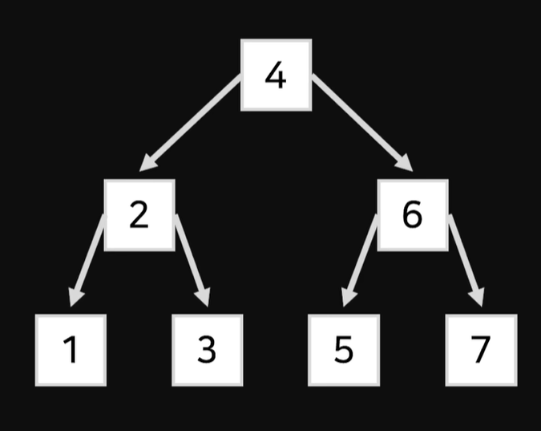

# 4주차(인덱스_b-tree)

추가 일시: 2026년 4월 14일 오전 6:26
강의: 스터디

### 디스크 읽기 방식

데이터베이스에 대한 쿼리문을 실행할 때 다음과 같은 디스크 i/o가 발생한다.

- 순차 i/o

→ 데이터를 순차적으로 읽고 쓰는 것

- 랜덤 i/o

→ 인덱스를 통해 여기저기 흩어져 있는 데이터를 읽고 쓰는 것

디스크에 따라 읽고 쓰는 방식에 따라 속도가 다르긴 하지만, 순차가 랜덤보다 속도가 빠르다.

- 하드디스크

하드디스크는 데이터 저장용 원판을 가지고 있고, 디스크 헤더가 돌아가는 원판에 데이터를 읽거나 쓴다.

순차의 경우 읽고 쓰는 데이터가 연속적이여서 디스크 헤더가 한번만 움직이면 된다.

랜덤의 경우 읽고 써야되는 데이터가 파편화 되어있어 디스크 헤더가 페이지 수만큼 움직여야된다.

**페이지 - 디스크와 메모리에 데이터를 읽고 쓰는 최소 단위

- SSD

플래시 메모리를 이용한 병렬처리로 인해 속도가 하드디스크보다 빠르다.

순차는 병렬처리를 효율적으로 이용하여 속도가 빠르다.

랜덤은 페이지가 연속적이지 않아서 병렬처리를 효율적으로 이용하지 못하기 때문에 순차에 비해 속도가 느리다.

- 랜덤 i/o만 비교하면 SSD가 하드디스크에 비해 훨씬 속도가 빠르다.
- 간단 표 정리

| **구분** | **순차 I/O (Sequential I/O)** | **랜덤 I/O (Random I/O)** |
| --- | --- | --- |
| **방식** | 데이터를 순서대로 차례차례 읽기 | 여기저기 흩어진 데이터를 점프하며 읽기 |
| **물리적 동작** | 헤더 이동 최소화, 한 번에 대량 읽기 | 헤더가 계속 움직임 (**탐색 시간 발생**) |
| **성능** | **매우 빠름** | **상대적으로 느림** |
| **발생 상황** | 풀 테이블 스캔 (Full Scan) | **인덱스 조회**, 일반적인 데이터 접근 |
| **효율성** | 적은 시스템 콜로 많은 페이지 획득 | 데이터 건수만큼 빈번한 시스템 콜 발생 |

### 인덱스를 공부하면서 읽기 방식에 대한 이해가 중요한 이유

인덱스를 쓰는 이유는 데이터베이스 검색속도를 향상시키기 위해서인데, 인덱스를 사용하면 랜덤 i/o가 발생한다. 그런데 여기서 랜덤 i/o라는게 속도가 느리기 때문에, 랜덤 i/o가 많이 발생할수록(읽어야하는 페이지가 많을수록) 순차 i/o를 쓰는 것보다 비용이 많이 나온다. 그래서 이 랜덤 i/o라는 것을 얼마나 적게 발생하느냐가 핵심이고 이것이 인덱스 트리구조 설계와도 이어진다. (페이지를 덜 읽는 것)

→ 랜덤 i/o가 순차 i/o보다 비용이 비싸다.

→ 

## 인덱스

어떤 특정 데이터를 찾을 때 데이터베이스 테이블의 모든 레코드를 읽어서 찾는다.

저장된 레코드의 수가 적당하다면 속도도 적당

이때 레코드의 개수가 엄청 많다면? (ex 1억개의 행)

모든 레코드를 순회해야하니까 속도가 엄청 느려진다.

그래서 특정 칼럼의 값과 칼럼과 매칭되는 레코드의 주소를 key-value  쌍으로 둔 인덱스를 만드는 것이이다. 칼럼만 조회해서 레코드를 찾을 수 있게 한다.

### 인덱스의 자료구조 형

정렬을 기준으로 자료구조 2개가 있다.

- SortedList

데이터를 저장할 때마다 정렬한다.

- ArrayList

정렬하지 않고 데이터 저장되는 순서대로 저장한다..

→ 인덱스는 여기서 SortedList이다. 

select문 같은 경우는 정렬되어있고 검색만하면 되니까 속도가 빠르다.(데이터 검색)

insert, update, delete 문장의 경우 실행하고 정렬을 해야하니까 속도가 상대적으로 느려질 수 밖에 없다.(데이터 저장 관련 기능)

**정리**하자면 인덱스는 데이터 저장성능을 감수하고 데이터 읽기 속도를 높이는 기능이다. 데이터 검색 기능이 중요하다 생각되면 인덱스의 수를 늘리면서 데이터 저장속도 타협을 고려해볼 수 있다는 것이다.

- 정렬을 왜 하나면 검색할 때의 속도를 높이기 위해서 필요하다. 정렬을 하게되면 여러 데이터를 덩어리로 쪼개서 검색이 가능한데 그러면 읽어야되는 데이터의 개수가 줄어든다.

### 인덱스 역할별 구분

- 프라이머리 키

데이터파일의 레코드를 대표하는 칼럼의 값으로 만들어진 인덱스이다.

그러므로 이 인덱스는 해당 레코드를 식별할 수 있는 기준값되므로 식별자라고도 한다.

- 보조 키(세컨더리 인덱스)

프라이머리를 제외한 모든 인덱스를 말한다. 보통 프라이머리 키의 주소값을 가지고 있다.

→ PK에만 해당 레코드를 연결해두면 관리하기 편하다. 실제 데이터를 수정할 때마다 프라이머리 키 인덱스만 실제 데이터를 수정하고 나머지 인덱스에는 주소값만 수정하면 된다.

### 인덱스 데이터 저장 방식별 구분

- B-Tree

원래의 값을 이용해 인덱싱하는 알고리즘

트리구조이기 때문에 범위 검색에 효율적이다.

- Hash

칼럼의 값을 해시화해서 인덱싱한다. 

해시값을 이용해 하나의 특정 값을 찾는데 효율적이다.

## B - tree

tree 구조를 왜 쓰냐하면 정렬된 데이터를 여러 덩어리로 쪼개 소거하면서 데이터를 찾기에 최적화된 자료구조라서 검색이 빠르다.

이러한 구조를 잘 볼  수 있게 이진 탐색 트리를 예를 들어보겠다.

이러한 구조는 반씩 소거하면서 최대 2번의 페이지 이동만에 원하는 값을 찾을 수 있다. 

이동을 최소화하면서도 성능을 개선시키고 싶다? 그것을

→ **B - tree** (여기서 B는 balanced이다. 균형을 맞춰 구조를 만들기 때문에)

이진 탐색 트리 노드마다 하나의 데이터가 아니라 N개의 데이터를 넣어서 더 많은 데이터를 최소한의 이동으로 검색을 가능하게 만든 트리이다.

근데 왜 깊이를 늘리지 않고 노드 하나에 여러개의 데이터를 넣느냐 하면 페이지 이동마다 **랜덤 i/o가 발생함!** 그래서 많은 데이터를 최소한의 이동으로 검색 가능하게끔 설계를 한 것이다.

이 B -  tree 구조에서 리프노드에만 실제 데이터값이 존재하고 나머지 노드에는 다음 노드를 가리키는 포인터 주소값만 가진다면?

→ **B+ tree**

최상위 노드 - 루트노드

가장 최하위 노드 - 리프 노드

둘 중 어디에도 해당되지 않는 노드 - 브랜치 노드

## 책에서 설명되는 b - tree 구조

### MylSAM

1개의 B + tree 구조를 이용해 리프노드에 있는 레코드 주소를 통해 실제 데이터 값을 바로 찾아간다.

### InnoDB

2개의 B + tree 구조를 이용한다. 

인덱스를 통해 리프노드에서 프라이머리 키값을 찾고

한 번 더 프라이머리 키 인덱스를 검색하여 프라이머리 키 인덱스 리프 노드에 저장돼 있는 데이터 레코드를 읽는다.

## 인덱스 키 추가 및 삭제

쿼리문 실행시 어떤식으로 인덱스 키에 적용되는지 살펴보기

### 추가

b - tree 적절한 위치를 검색하면서 리프노드에 빈 공간이 있으면 레코드의 키값과 대상 레코드의 주소 정보를 리프노드에 저장한다. 하지만 꽉 찾다면 페이지 분할까지 일어나면서 브랜치 노드까지 작업하므로 비용이 더 많이 든다.

### 삭제

데이터를 물리적으로 지우는 것이 아닌 해당하는 키 값에 삭제마크만 표시한다. 마킹된 공간은 방치하거 재사용할 수 있다.

### 변경

키 값은 그 값에 따라 위치가 리프노드의 위치가 결정되므로, 인덱스의 키 값만 변경하는 것은 불가능하다. 따라서 기존 키를 삭제하고 새로운 키를 적절한 위치에 추가하는 이중 작업이 발생한다.

### 검색

검색이 인덱스의 구축 이유이다. 앞의 세가지 기능을 손해보면서도

루트 노드부터 시작해 최종 리프 노드까지 이동하면서 비교 작업을 수행한다.

| **작업** | **성능 영향** | **핵심 이유** |
| --- | --- | --- |
| **추가** | 큼 (느려짐) | 페이지 분할(Split) 발생 가능성 때문 |
| **삭제** | 적음 (보통) | 삭제 마킹만 하고 나중에 정리하기 때문 |
| **변경** | 매우 큼 (느림) | **삭제 후 추가**라는 이중 작업 발생 |
| **검색** | 매우 적음 (빠름) | 정렬된 구조를 이용해 탐색 범위를 소거하기 때문 |

## b - tree 인덱스 사용에 영향을 미치는 요소

인덱스를 사용하면서 성능을 높이려면 고려해야되는 요소 4가

### 인덱스 키 값의 크기

페이지에 16KB 크기의 데이터를 담을 수 있는데 키의 값이 커질 수록 한 페이지에 들어가는 키의 개수가 줄어든다. 키 값이 크면 더 많은 페이지를 읽어야되서 디스크 읽는 횟수가 늘어나 느려진다.

- 키값이 커지는 요소 예시
인덱스로 설정한 칼럼의 타입이 `INT`(4바이트)에서 `BIGINT`(8바이트)로 바뀌거나, `VARCHAR(10)`에서 `VARCHAR(255)`로 커지는 것을 의미

### B-Tree 깊이

깊이는 페이지 이동 횟수에 관련되어있으므로 매우 중요하다. 예를들어 인덱스의 키값의 증가로 페이지가 증가하면서 깊이가 길어질 경우 랜덤 I/O 횟수가 늘어나 느려진다. 그러므로 깊이를 작게 설계해야한다.

### 선택도

전체 레코드 중에서 유니크한 값의 개수가 많을수록 검색대상이 줄어들어 속도에 영향을 미친다.

#### **1. 선택도가 낮은 예시 (Low Selectivity)**

- **칼럼:** 성별 (`Gender`)
- **데이터:** 남, 여 (2가지 값만 존재)
- **상황:** 100만 명의 데이터가 있을 때, '남'을 검색하면 약 **50만 건**이 나옵니다.
- **인덱스 효율:** **매우 낮음.**
    - 인덱스를 타고 들어가 봤자 여전히 전체의 50%를 더 읽어야 합니다.
    - DB 입장에서는 인덱스를 뒤지는 것보다 그냥 처음부터 끝까지 테이블을 쭉 읽는(Full Scan) 게 더 빠릅니다.

#### **2. 선택도가 높은 예시 (High Selectivity)**

- **칼럼:** 이메일 주소 (`Email`) 또는 주민번호
- **데이터:** 모든 사용자가 거의 고유한 값을 가짐.
- **상황:** 100만 명의 데이터가 있을 때, 특정 이메일을 검색하면 딱 **1건**이 나옵니다.
- **인덱스 효율:** **매우 높음.**
    - 단 한 번의 B-Tree 탐색으로 원하는 위치를 정확히 찾아낼 수 있습니다.
    - 검색 대상이 기하급수적으로 줄어들기 때문에 인덱스의 효과를 100% 누릴 수 있습니다.

### 읽어야 하는 레코드의 건수

인덱스를 통해 읽어야 하는 레코드의 건수가 전체 테이블의 20 ~ 25%를 넘어가면 인덱스를 이용하지 않고 테이블을 모두 직접 읽어서 필요한 레코드만 가려내는 방식이 효율적이다.

왜냐하면 인덱스를 이용하면 랜덤 i/o가 발생하는데 이것이 테이블을 모두 직접 읽는 순차 i/o의 비용을 넘어서기 때문이다.

## b - tree 인덱스를 통한 데이터 읽기

인덱스 읽기는 쿼리의 조건(`WHERE`)이나 필요한 데이터의 범위에 따라 달라진다.

### **1. 인덱스 레인지 스캔 (Index Range Scan)**

뒤에 두가지 접근방법과 비교하면 상대적으로 빠른 방법이다. 

검색해야 할 인덱스의 범위가 결정됐을 때 사용하는 방식이다. (시작과 끝이 정해짐)

왜 범위가 정해지냐면 다음과 같이 스캔이 진행되기 때문이다.

- 루트 → 브랜치 → 리프 노드로 내려가면서 리프노드의 시작점을 찾고(수직적 탐색)
- 이제 리프노드가 양방향 연결리스트로 연결되어있기 때문에 리프를 이동하면서 오름차순 혹은 내림차순으로 원하는 범위 끝까지 인덱스 스캔을 한다. (순차 i/o에 가까움)
- 스캔을 한 키와 레코드 주소를 이용해 레코드가 저장된 페이지를 가져오고 최종 레코드를 읽어온다. → 이걸 안하면 커버링 인덱스라고 한다.
- **언제 발생하는가:** `WHERE` 절에 `<`, `>`, `BETWEEN`, `LIKE 'abc%'` 등의 범위 조건이 있을 때 발생한.
- **특징:** 시작 지점만 찾으면 그 뒤는 정렬된 상태로 쭉 읽기만 하면 되므로 매우 빠릅니다. (단, 읽어야 할 레코드가 너무 많으면 손익분기점을 넘겨 Full Scan으로 전환될 수 있습니다.)

→ 데이터 파일에서 레코드를 읽어오는 과정이 필요한데, 실제 레코드 데이터는 인덱스 순서대로 정렬되어있지 않기 때문에 읽어올 때마다 랜덤 i/o가 발생한다.

### **2. 인덱스 풀 스캔 (Index Full Scan)**

레인지 스캔과 달리 리프노드의 시작점을 찾지 않고, 리프노드의 처음으로 가서 끝까지 다 읽는다. 

그리고 레코드 값을 읽어오지 않는다. 인덱스만 읽는다. 그럼 왜 씀?

레코드와 인덱스는 1 ㄷ 1 매칭이기 때문에 count를 써서 개수를 세거나 인덱스의 필요한 colum이 포함되어 있을 경우에 사용한다.

인덱스 레인지 스캔과 비교해서는 느리고, 테이블 풀 스캔보다는 빠르다.

- **언제 발생하는가:** 쿼리에서 필요한 칼럼이 모두 인덱스에 포함되어 있지만, `WHERE` 절에서 인덱스의 첫 번째 칼럼을 조건으로 사용하지 않을 때 발생합니다.
- **특징:** 테이블 전체를 읽는 것보다 인덱스 파일의 크기가 훨씬 작기 때문에 사용된다.

---

### **3. 루스 인덱스 스캔 (Loose Index Scan)**

인덱스 레인지 스캔과 비슷하게 작동하지만, 레인지 스캔과 달리 중간에 필요하지 않은 인덱스 키값은 스킵하고 다음으로 넘어가는 형태로 처리한다. 

- **언제 발생하는가:** 주로 `GROUP BY`나 `MAX()`, `MIN()` 함수가 포함된 쿼리에서 최적화할 때 발생합니다.
- **특징:** 중간에 필요 없는 키 값들을 무시하고 넘어가기 때문에 아주 효율적입니다. (예: "각 부서별로 연봉이 가장 높은 사람 한 명씩만 찾아줘"라고 할 때 부서 인덱스를 타고 들어가서 최대값만 찍고 다음 부서로 바로 넘어가는 식입니다.)

| **방식** | **성능** | **핵심 요약** |
| --- | --- | --- |
| **레인지 스캔** | **매우 빠름** | 시작점 찾고 범위만큼만 긁어오기 |
| **풀 스캔** | **보통** | 인덱스 전체를 다 훑기 (테이블 풀 스캔보다는 작아서 빠름) |
| **루스 스캔** | **매우 빠름** | 필요한 지점만 딱딱 집어서 건너뛰며 읽기 |

### 인덱스 스킵 스캔

복합 인덱스에서 첫 번째 컬럼을 조건절(`WHERE`)에 사용하지 않아도 인덱스를 사용할 수 있게 해주는 기능
? 솔직히 잘 모르겠음

## ㄷ ㅏ중칼럼 인덱스

칼럼이 2개 이상 포함된 인덱스를 다중 칼럼 인덱스라고 한다. 

데이터 레코드 수가 적은 경우 브랜치 노드가 없는 경우도 있을 수 있다. 하지만 루트 노드와 리프 노드는 항상 존재한다. 정렬의 기준의 두번째 칼럼의 경우 첫번째 칼럼에 의존해서 정리된다. 세번째 칼럼은 두번째 칼럼에 의존해서 정리된다.

## B - tree 인덱스의 정렬 및 스캔 방향

인덱스의 정렬은 오름차순 혹은 내림차순으로 정리된다.

### 인덱스 스캔 방향

### 1. 인덱스의 양방향 탐색 구조

인덱스의 리프 노드는 **쌍방향 연결 리스트(Double Linked List)**로 되어 있습니다.

- **정방향 스캔(Forward Scan):** 리프 노드의 왼쪽에서 오른쪽으로 링크를 따라가는 것.
- **역방향 스캔(Backward Scan):** 리프 노드의 오른쪽에서 왼쪽으로 링크를 따라가는 것.

---

### 2. 정방향 스캔 vs 역방향 스캔

데이터가 1부터 10까지 오름차순(ASC)으로 생성된 인덱스가 있다고 가정해 봅시다.

### **정방향 스캔 (Forward Scan)**

- **쿼리:** `SELECT * FROM table ORDER BY col ASC;`
- **동작:** 인덱스의 가장 왼쪽(최솟값)부터 시작해서 오른쪽으로 순차적으로 읽습니다.

### **역방향 스캔 (Backward Scan)**

- **쿼리:** `SELECT * FROM table ORDER BY col DESC;`
- **동작:** 인덱스의 가장 오른쪽(최댓값)부터 시작해서 왼쪽으로 거꾸로 읽습니다.

---

### 3. 성능 차이가 있을까? (중요!)

이론적으로는 똑같을 것 같지만, 실무적으로(특히 MySQL InnoDB 기준)는 **역방향 스캔이 약간 더 느립니다.** 『Real MySQL』에서도 이 이유를 두 가지로 설명합니다.

1. **페이지 잠금(Page Lock) 구조:** InnoDB의 페이지 내부 레코드는 단방향으로만 연결되어 있어, 역방향으로 읽을 때는 페이지 내부에서 복잡한 과정을 거칩니다.
2. **페이지 내 순차 읽기:** CPU와 메모리 구조상 순방향으로 데이터를 읽는 것이 하드웨어 최적화에 더 유리하게 설계되어 있습니다.