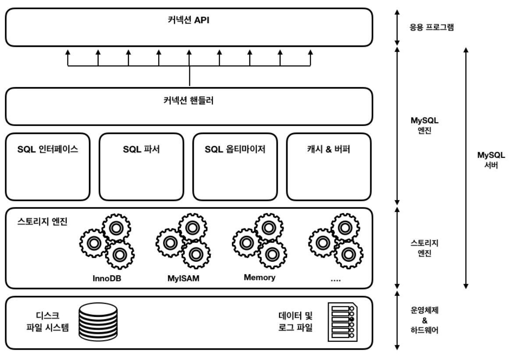

# 6주차(4장 1절 MySQL 엔진)

추가 일시: 2026년 4월 28일 오전 5:42
강의: 스터디

## MySQL 서버의 전체 구조



MYSQL 엔진

- 클라이언트로부터의 접속 및 쿼리 요청을 처리하는 커넥션 핸들러, SQL 파서, 옵티마이저 등 요청된 SQL 문장을 분석하거나 최적화하는 엔진이다. `GROUP BY`, `ORDER BY` 등 복잡한 처리는 해당 엔진의 처리 영역인 쿼리 실행기에서 실행된다.

스토리지 엔진

- 실제 데이터를 디스크 스토리지에 저장하거나 읽어들이는 역할을 하는 엔진이다. MYSQl 엔진에서는 반드시 **핸들러 API**를 통해 스토리지 엔진과 데이터를 주고받는다. `MyISAM`, `InnoDB` 두 가지 종류가 존재한다.

### 핸들러 API

퀴리문에서 데이터 쓰거나 읽어야 될 경우에는 MySQL 엔진에서 스토리지 엔진으로, 핸들러 요청이라는 것을 보내게 된다. 이때 사용되는 api를 핸들러 API 라고 한다.

### MySQL 스레딩 구조

mysql 서버는 스레드 기반으로 작동한다. 크게 포그라운드, 백그라운드 스레드로 나뉜다.

#### 스레드

왜 스레드를 사용하냐면, 여러 사용자가 동시에 작업을 요청을 했을 때 동시에 처리해서 빠른 속도감을 제공하기 위해서이다. 프로세스 단위로는 너무 무거워서 사용하기 빡세다.

```sql
MySQL 서버 프로세스
├─ 스레드 1 → 사용자 A 요청 처리
├─ 스레드 2 → 사용자 B 요청 처리
├─ 스레드 3 → 사용자 C 요청 처리
└─ 스레드 4 → 사용자 D 요청 처리
```

스레드는 다음과 같은 MySQL 서버 안의 자원을 공유할 수 있다.

```bash
버퍼 풀
테이블 캐시
락 정보
실행 계획 관련 정보
커넥션 정보
```

### 포그라운드 스레드

포그라운드 스레드는 MySQL 서버에 접속된 클라이언트 수만큼 존재하며, 각 요청 쿼리를 직접 처리한다.(SELECT, INSERT, UPDATE, DELETE 같은 SQL 실행을 담당한다.) 사용자가 커넥션을 종료하면, 해당 스레드는 스레드 캐시로 되돌아간다. 

읽기 작업 시 먼저 버퍼 풀에서 데이터를 찾고, 없으면 디스크에서 읽어온다.

- **스레드 캐시**

스레드 보관 창고

접속이 종료될 때마다 스레드를 제거하고 새 접속마다 다시 생성하면 비용이 크다.

그래서 MySQL은 사용이 끝난 스레드를 thread cache에 보관했다가,

새로운 접속 요청이 들어오면 기존 스레드를 재사용한다.

관련 설정:

- thread_cache_size: 캐시에 보관할 수 있는 스레드 수

### 백그라운드 스레드

백그라운드 스레드는 사용자 요청과 직접 연결되지 않고 뒤에서 동작하는 스레드이다.

주로 변경된 데이터 페이지를 디스크에 기록하거나, 로그 처리, 체크포인트, 정리 작업 등을 수행한다.

InnoDB는 데이터를 변경할 때 바로 디스크에 쓰지 않고, 먼저 버퍼 풀의 페이지를 수정한다.

이렇게 메모리에서는 변경되었지만 아직 디스크에는 반영되지 않은 페이지를 Dirty Page라고 한다.

Dirty Page는 이후 백그라운드 스레드에 의해 디스크에 기록된다.

- 포그라운드, 백그라운드 실행 흐름

```bash
UPDATE users
SET point = point + 100
WHERE id = 1;
```

1. 포그라운드 스레드가 UPDATE 요청을 받음
2. 변경할 데이터를 버퍼 풀에 올림
3. 버퍼 풀 안의 데이터 페이지를 수정함 → dirty page
4. 변경 기록을 로그에 남김 → redo 로그
5. 사용자에게 성공 응답 → redo 로그 파일에 동기화
6. 나중에 백그라운드 스레드가 변경된 페이지를 디스크에 기록

### 메모리 할당 및 사용 구조


MySQL 서버의 메모리는 크게 글로벌 메모리 영역과 로컬 메모리 영역으로 나뉜다.

두 영역은 여러 스레드가 공유하는지 여부에 따라 구분된다.

1. 글로벌 메모리 영역

글로벌 메모리 영역은 MySQL 서버가 시작될 때 운영체제로부터 할당받는 전역 메모리 공간이다.

클라이언트 스레드 수와 무관하게 서버 단위로 존재하며, 모든 스레드가 공유한다.

대표적인 글로벌 메모리 영역에는 테이블 캐시, InnoDB 버퍼 풀, InnoDB 어댑티브 해시 인덱스, InnoDB 리두 로그 버퍼가 있다.

- InnoDB 버퍼 풀은 데이터 페이지와 인덱스 페이지를 메모리에 캐싱하는 공간으로, SELECT 시 먼저 버퍼 풀에서 데이터를 찾고, UPDATE 시에는 버퍼 풀의 페이지를 먼저 수정한다.
- 리두 로그 버퍼는 데이터 변경 내용을 리두 로그 파일에 기록하기 전에 임시로 저장하는 메모리 공간이다.

글로벌 메모리 영역은 MySQL 서버가 종료될 때까지 유지되므로, 크기를 너무 크게 설정하면 운영체제 메모리 부족이나 스왑이 발생할 수 있다.

2. 로컬 메모리 영역

로컬 메모리 영역은 클라이언트 스레드가 쿼리를 처리할 때 사용하는 메모리 영역이다.

세션 메모리 영역이라고도 하며, 각 클라이언트 스레드마다 독립적으로 할당된다.

대표적인 로컬 메모리 영역에는 커넥션 버퍼, 결과 버퍼, 소트 버퍼, 조인 버퍼가 있다.

로컬 메모리 영역은 스레드마다 따로 할당되므로,

동시 접속 수가 많거나 정렬/조인 작업이 많은 경우 전체 메모리 사용량이 크게 증가할 수 있다.

### 플러그인 스토리지 엔진 모델, 컴포넌트

#### 플러그인 스토리지 엔진 모델

MySQL은 스토리지 엔진을 플러그인처럼 교체하거나 추가할 수 있는 구조를 가진다.

이 구조 덕분에 테이블마다 목적에 맞는 스토리지 엔진을 선택할 수 있다.
대표적인 스토리지 엔진에는 InnoDB, MyISAM, Memory 등이 있다.

현재는 트랜잭션, 외래키, 행 단위 잠금, 장애 복구 기능을 지원하는 InnoDB가 기본적으로 많이 사용된다.

#### 컴포넌트

컴포넌트는 MySQL 서버 기능을 모듈 단위로 확장하기 위한 구조이다.
플러그인보다 더 현대적인 확장 방식으로,
MySQL 서버 내부 기능을 독립적인 모듈처럼 로드하고 사용할 수 있게 한다.

주로 인증, 보안, 키 관리 등 서버 기능 확장에 사용된다.

### 쿼리 실행 구조


### 1. 쿼리 파서

사용자 요청으로 들어온 쿼리 문장을 토큰으로 분리해 트리 형태의 구조로 만들어내는 작업을 의미한다. 기본 문법 오류를 여기에서 파악하고 사용자에게 오류 메시지를 전달한다.

### 2. 전처리기

파서 트리를 기반으로 쿼리 문장에 구조적인 문제점이 있는지 확인한다. 존재하지 않거나, 권한 상 사용할 수 없는 개체의 토큰을 파악하고 걸러낸다.

### 3. 옵티마이저

쿼리 문장을 가장 저렴한 비용으로 빠르게 처리할지 결정하는 역할을 수행한다.

### 4. 실행 엔진

실행 엔진은 옵티마이저를 통해 만들어진 최적화된 계획대로, 각 핸들러에게 요청해서 받은 결과를 다시 핸들러 요청의 입력으로 연결하는 역할을 수행한다. 예를 들어, WHERE 절에 일치하는 레코드를 읽어오도록 요청한 이후 해당 데이터를 임시 테이블로 저장하도록 요청할 수 있다.

### 5. 핸들러(스토리지 엔진)

MySQL 실행 엔진의 요청에 따라 데이터를 디스크로 저장하고, 디스크로부터 읽어 오는 역할을 담당한다.

```bash
1. 클라이언트가 UPDATE SQL 요청을 보냄

2. 쿼리 파서
SQL 문법 검사

3. 전처리기
users 테이블, point 컬럼, id 컬럼 확인
권한 확인

4. 옵티마이저
id 조건에 사용할 인덱스 선택
실행 계획 수립

5. 쿼리 실행기(실행 엔진)
스토리지 엔진에 해당 행 검색 및 변경 요청

6. 스토리지 엔진(핸들러)
버퍼 풀에서 데이터 페이지 확인
없으면 디스크에서 읽어 버퍼 풀에 적재
Undo Log에 변경 전 값 기록
버퍼 풀의 데이터 페이지 수정
Redo Log Buffer에 변경 내용 기록

7. COMMIT 시 Redo Log가 디스크에 기록됨

8. 변경된 Dirty Page는 나중에 백그라운드 스레드가 디스크에 반영
```

### 스레드 풀

#### 왜 스레드 풀이 필요할까?

MySQL은 기본적으로 전통적인 구조에서 **커넥션 하나당 스레드 하나** 방식으로 동작한다고 볼 수 있다.

```
커넥션 A → 스레드 A
커넥션 B → 스레드 B
커넥션 C → 스레드 C
커넥션 D → 스레드 D
```

접속 수가 적을 때는 괜찮다.

하지만 동시에 접속하는 클라이언트가 너무 많아지면 문제가 생긴다.

```
커넥션 1,000개 → 스레드 1,000개
커넥션 5,000개 → 스레드 5,000개
```

스레드가 너무 많아지면 CPU가 실제 쿼리를 처리하는 시간보다, 스레드 사이를 계속 바꿔가며 실행하는 데 시간을 많이 쓰게 된다.

이걸 **컨텍스트 스위칭 비용**이라고 한다.

```
스레드 A 실행
↓
스레드 B로 전환
↓
스레드 C로 전환
↓
스레드 D로 전환
```

즉, 스레드가 너무 많으면 오히려 성능이 떨어질 수 있다.

#### 스레드 풀의 동작 방식

스레드 풀은 일정 수의 작업 스레드를 준비해두고, 클라이언트 요청이 들어오면 그 요청을 큐에 넣은 뒤 사용 가능한 스레드가 처리하게 한다.

```
클라이언트 요청들
   ↓
작업 큐
   ↓
스레드 풀
   ├─ 작업 스레드 1
   ├─ 작업 스레드 2
   ├─ 작업 스레드 3
   └─ 작업 스레드 4
```

즉, 클라이언트가 100명이라고 해서 스레드를 100개 만드는 것이 아니라, 예를 들어 16개 정도의 스레드가 여러 요청을 번갈아 처리할 수 있다.

```
커넥션 100개
   ↓
스레드 풀의 제한된 스레드들이 작업 처리
```

#### 스레드 풀 주의사항

하지만, 스케줄링 과정에서 오히려 ****빈번한 컨텍스트 스위칭으로 인해 쿼리 처리가 더 느려질 수 있기 때문에 무작정 스레드 풀을 설정한다고 해서 성능이 2배 좋아지지 않는다.

적절한 스레드 수를 설정하면, ****프로세서 친화도를 높이고 불필요한 컨텍스트 스위치를 줄여 오버헤드를 낮출 수 있다.

일반적으로 스레드 풀 개수 = CPU 코어 개수 가 프로세서 친화도를 높이는 데 좋다. 스레드마다 `CPU` 가 바인딩 되어 있으니, 랜덤으로 다른 스레드를 실행시키지 않아 자연스럽게 컨텍스트 스위칭 비용이 줄어들기 때문이다.

### 트랜잭션 지원 메타데이터

메타데이터는 테이블, 컬럼, 인덱스, 뷰, 권한 등 데이터베이스 객체의 구조와 정의 정보를 의미한다.

MySQL 8.0부터는 이러한 메타데이터를 InnoDB 기반 데이터 딕셔너리에 저장한다.
따라서 메타데이터 변경 작업도 InnoDB의 트랜잭션 처리와 복구 기능의 도움을 받을 수 있다.

이를 트랜잭션 지원 메타데이터라고 한다.

과거 MySQL은 테이블 정의 정보를 .frm 파일 같은 파일 기반 메타데이터로 관리했다.
이 방식은 DDL 작업 중 장애가 발생하면 MySQL 내부 정보와 파일 시스템 정보가 불일치할 수 있었다.

MySQL 8.0에서는 메타데이터를 InnoDB 데이터 딕셔너리에 통합하여 관리하므로,
DDL 작업 중 장애가 발생해도 메타데이터의 일관성을 유지하기 쉽다.

주의할 점은, 트랜잭션 지원 메타데이터가 사용자가 DDL을 직접 ROLLBACK할 수 있다는 뜻은 아니라는 것이다.
DDL은 여전히 암묵적 커밋이 발생할 수 있다.

여기서의 의미는 MySQL 내부적으로 메타데이터 변경을 원자적이고 일관성 있게 처리하여,
성공하면 완전히 반영하고 실패하면 중간 상태가 남지 않도록 관리한다는 뜻이다.